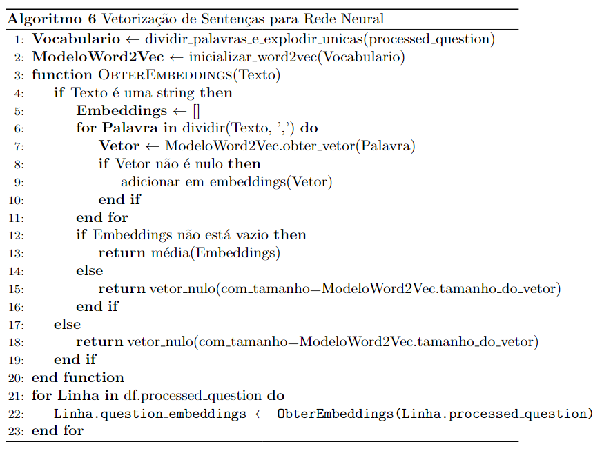

# Robô Conversacional Inteligente Baseado em Conhecimento para Atendimento ao Cliente: Otimização com Processamento de Linguagem Natural (PLN) e Geração de Respostas por IA Generativa

**Autores** 

Biondo, Elias

elias.biondo@sou.inteli.edu.br

Cabral, Rafael

rafael.cabral@sou.inteli.edu.br

Casado, Allan

allan.casado@sou.inteli.edu.br

Coutinho, Cristiane

cristiane.coutinho@sou.inteli.edu.br

Rojas, Melyssa

melyssa.rojas@sou.inteli.edu.br

Silva, Gabrio

gabrio.silva@sou.inteli.edu.br

Thomé, Giovana

giovana.thome@sou.inteli.edu.br

**Palavras-chave** 

Processamento de Linguagem Natural, PLN, NLP, Robô, Atendimento, Inteligência Artificial, Otimização, Interação Homem-Máquina, Sistema Baseado em Conhecimento, Automação, Chatbot e Análise de Texto.

## Resumo

Este estudo detalha a implementação de um robô conversacional baseado em inteligência artificial com o objetivo de otimizar o atendimento ao cliente em uma empresa de remessas financeiras no Japão. A solução proposta emprega técnicas de Processamento de Linguagem Natural (PLN) e modelos de Inteligência Artificial (IA) generativa, visando aprimorar a eficiência do Serviço de Atendimento ao Cliente (SAC), que atualmente gerencia mais de 25 mil interações mensais através de chat online. A introdução do robô conversacional permite que os atendentes humanos dediquem seus esforços a questões de maior complexidade. Este trabalho aborda os desafios encontrados durante o desenvolvimento e implementação, além de sugerir direções para futuras pesquisas e aplicações práticas no campo do atendimento automatizado ao cliente.

## Introdução

O suporte ao cliente é essencial para qualquer empresa de serviços, desempenhando um papel crucial na satisfação e fidelização dos consumidores (Barbosa & Godoy, 2021). Com a evolução das tecnologias de Processamento de Linguagem Natural (PLN) e Inteligência Artificial (IA), os agentes conversacionais, ou chatbots, têm se tornado comuns, facilitando a interação entre empresas e clientes (Mnasri, 2019).

A gestão do conhecimento de suporte ao cliente tem crescido nas indústrias de alta tecnologia, permitindo que as organizações ofereçam soluções de autoatendimento e abordem questões tecnológicas e de gestão (Davenport & Klahr, 1998). Além disso, a integração dos requisitos de suporte ao cliente no desenvolvimento de novos produtos é crucial para o sucesso do marketing e inovação (Goffin & New, 2001). Goffin (1999) destaca a importância de estabelecer canais e estratégias adequadas para fornecer suporte de alta qualidade.

Em redes habilitadas para a web, o aumento das taxas de pessoal pode melhorar os tempos de resposta ao cliente, mas a demanda constante requer recursos elevados, o que pode ser um desafio (Shankar, Vijayaraghavan & Narendran, 2006). Nesse contexto, os chatbots surgem como programas que fornecem serviços aos usuários por meio de conversas em linguagem natural, atuando como assistentes virtuais em redes sociais ou aplicações web (Pérez-Soler et al., 2021). Esses agentes inteligentes podem fornecer respostas precisas às consultas online dos clientes, reduzindo a dependência humana e a necessidade de diferentes sistemas para diferentes processos (Jadhav et al., 2022).

A adoção de chatbots em diversos setores tem demonstrado um potencial significativo para transformar a prestação de serviços, especialmente no atendimento ao cliente. Organizações globais estão explorando e implementando essas tecnologias para aprimorar a eficiência operacional e a satisfação do usuário. A revolução trazida pelos chatbots abrange diversas áreas, incluindo educação, serviço ao cliente, entretenimento e assistentes pessoais, liberando profissionais de tarefas repetitivas e aprimorando as soluções baseadas em IA (Han, 2023).

Este estudo detalha a implementação de um robô conversacional baseado em IA, com o objetivo de otimizar o atendimento ao cliente em uma empresa de remessas financeiras no Japão. A solução proposta emprega técnicas de PLN e modelos de IA generativa, visando aprimorar a eficiência do Serviço de Atendimento ao Cliente (SAC), que atualmente gerencia mais de 25 mil interações mensais através de chat online. A introdução do robô conversacional permite que os atendentes humanos concentrem seus esforços em questões de maior complexidade, elevando a qualidade geral do serviço prestado.

A aplicação do processamento da linguagem natural em chatbots está revolucionando a maneira como as empresas interagem com seus clientes. Os avanços recentes em Modelos de Linguagem de Recuperação e Geração (RAG) têm aprimorado significativamente o desempenho dos chatbots (Torres et al., 2024).Nesse contexto, é essencial desenvolver modelos de medição que avaliem a qualidade do serviço prestado pelos chatbots e seus impactos em métricas de relacionamento com o cliente. Além disso, a implementação de chatbots em ambientes de alta demanda, como o da empresa de remessas financeiras, apresenta desafios únicos que precisam ser abordados para garantir uma transição suave e eficaz.

Este trabalho aborda os desafios encontrados durante o desenvolvimento e implementação do robô conversacional, incluindo questões técnicas relacionadas ao processamento de linguagem natural e à integração com sistemas existentes. Além disso, sugere direções para futuras pesquisas e aplicações práticas no campo do atendimento automatizado ao cliente, contribuindo para o corpo emergente de conhecimento sobre interfaces conversacionais.

O trabalho está estruturado da seguinte forma: inicialmente, apresentamos a introdução, onde contextualizamos o tema e revisamos a literatura relacionada à experiência do usuário e à qualidade do serviço em chatbots. Em seguida, detalhamos as questões de pesquisa e a metodologia adotada para o estudo. Posteriormente, discutimos as principais descobertas obtidas. Por fim, abordamos as implicações dos resultados para a pesquisa acadêmica e a indústria, destacamos as limitações do estudo e propomos direções para futuras investigações. Esta pesquisa proporciona insights valiosos para a implementação eficaz de chatbots em ambientes de atendimento ao cliente, com o potencial de aprimorar significativamente tanto a eficiência operacional quanto a satisfação do usuário.

## Trabalhos Relacionados

Esta seção aborda a literatura existente sobre o uso de modelos de Processamento de Linguagem Natural (PLN) para a criação de chatbots e outras aplicações. Foram consultadas bases bibliográficas como IEEE Access, o Natural Language Processing Journal, e o Simpósio Brasileiro de Tecnologia da Informação e da Linguagem Humana (STIL). As pesquisas foram realizadas utilizando as queries: "chatbots using NLP models", "NLP models and applications", "implementation of NLP", "building conversational agents with NLP", "LLM para chatboot", "nlp para chatboot", "LLM para atendimento ao cliente", "rag chatboot chatgpt" e "using languange natual for chatboots". A seguir, descrevemos os estudos revisados, destacando seus pontos positivos e negativos.

Attigeri (2024) apresenta um estudo focado no desenvolvimento de um chatbot para fornecer informações sobre a vida universitária, utilizando modelos de PLN. O modelo Hércules, que se destacou com uma acurácia de 98,3%, foi selecionado após uma análise comparativa de cinco modelos distintos. O estudo se beneficiou de técnicas de otimização que aprimoraram a performance do modelo, minimizando o risco de overfitting. Entretanto, a pesquisa não abordou com profundidade a infraestrutura necessária para a implementação dos modelos e revelou limitações em termos de generalização fora do contexto universitário. Além disso, a análise de sentimento não foi extensivamente explorada, o que poderia ter ampliado a aplicabilidade do modelo.

Roumeliotis et al. (2024) realizaram uma comparação entre os modelos GPT e LLaMA no contexto de análise de sentimentos em e-commerce. O estudo demonstrou que o fine-tuning contribui significativamente para a melhoria da performance dos modelos, especialmente ao considerar as intenções dos clientes em relação aos produtos. Apesar dos bons índices de acurácia alcançados, os modelos ainda enfrentaram desafios relacionados ao desbalanceamento dos dados e à falta de capacidade para lidar com outros tipos de dados, como imagens. Esses fatores limitam a aplicabilidade dos modelos em cenários de e-commerce mais gerais.

Barbosa e Godoy (2021) exploraram a aplicação do modelo BERT em português para melhorar o atendimento ao cliente em empresas brasileiras. O chatbot desenvolvido mostrou-se eficaz na organização e realocação de equipes de atendimento, utilizando dados das interações anteriores dos usuários e técnicas como word-embeddings e um mecanismo de atenção para prever a classe mais adequada. Um dos maiores desafios enfrentados foi a limitação de recursos disponíveis para a língua portuguesa, obrigando os autores a depender de modelos pré-treinados e datasets privados. Apesar disso, o modelo BERT, quando combinado com dados tabulares, apresentou a melhor performance com uma acurácia de 53,2%. No entanto, a pesquisa não abordou adequadamente a infraestrutura necessária e faltou uma comparação com modelos feitos à mão, o que poderia ter proporcionado uma análise mais completa dos resultados.

Mnasri (2019) explora o estado atual dos sistemas de diálogo, categorizando-os em chatbots sociais e chatbots orientados a tarefas. Os chatbots sociais são projetados para conversas humanas não estruturadas, enquanto os chatbots orientados a tarefas têm especialização em domínios específicos. O trabalho destaca a evolução desses sistemas, impulsionada pelos avanços em Processamento de Linguagem Natural (NLP) e Inteligência Artificial (IA), e propõe uma visão para a padronização na construção desses sistemas. Também destaca abordagens de construção de chatbots, incluindo modelos baseados em regras e modelos baseados em dados. Além disso, sugere a necessidade de padronização na construção de sistemas de diálogo.

Torres (2024) propõe um framework para gerar pares de perguntas e respostas (QA) semelhantes aos humanos, com respostas longas ou factuais, de forma automática. Além disso, o framework é usado para avaliar a qualidade de modelos de Recuperação Aumentada por Geração (RAG) e criar datasets para avaliar níveis de alucinação de Modelos de Linguagem Grande (LLMs) simulando perguntas sem resposta. O framework gerou um dataset de QA baseado em mais de 1.000 folhetos sobre procedimentos médicos e administrativos de um hospital, mais de 50% dos pares QA foram considerados aplicáveis pelos especialistas hospitalares. O framework foi aplicado para avaliar o desempenho do modelo Llama-2-13B (ajustado para o holandês), mostrando que a metodologia é promissora para testar modelos em relação a perguntas não respondíveis e factuais. O modelo teve dificuldade com perguntas respondíveis, não conseguindo responder cerca de 40% delas. No entanto, conseguiu recusar corretamente responder a perguntas não respondíveis aproximadamente 90% das vezes.

Saito (2020) aborda o desenvolvimento de um chatbot para recomendação de disciplinas da USP, utilizando técnicas de processamento de linguagem natural (NLP). A ferramenta escolhida para a interface foi o DialogFlow, que se mostrou eficiente e de fácil uso. O sistema de recomendação foi construído com base na similaridade entre os temas desejados pelos usuários e os conteúdos das disciplinas, utilizando a biblioteca Gensim para calcular a similaridade entre vetores de tokens. Embora o sistema tenha cumprido os requisitos básicos, foram identificados desafios como a baixa representatividade de certas abordagens e limitações na quantidade de dados processados. O estudo destaca a potencialidade do chatbot, mas aponta que há espaço para avanços significativos, especialmente na implementação de modelos de aprendizado por reforço e na utilização de abordagens mais complexas de NLP, como o OpenKE.

| **Critérios**                       | **Attigeri et al. (2024)**                              | **Roumeliotis et al. (2024)**                           | **Barbosa e Godoy (2021)**                            | **Mnasri (2019)**                                 | **Torres et al. (2024)**                           | **Saito e Miura (2020)**                           |
|-------------------------------------|---------------------------------------------------------|--------------------------------------------------------|------------------------------------------------------|---------------------------------------------------|--------------------------------------------------|--------------------------------------------------|
| **Contexto**                        | Desenvolvimento de chatbot para informações universitárias | Análise de sentimentos em e-commerce                   | Atendimento ao cliente com BERT em português        | Revisão de modelos existentes                    | Geração de QA e avaliação de modelos RAG         | Recomendação de disciplinas na USP               |
| **Modelo Principal**                | Hércules (Modelagem Sequencial)                        | GPT e LLaMA                                             | BERT (com dados tabulares)                          | Chatbots sociais e orientados a tarefas          | Llama-2                                        | Gensim                                           |
| **Idioma**                          | Inglês                                                 | Inglês                                                  | Português                                             | Inglês                                        | Inglês                                          | Português                                       |
| **Pontos Positivos**                | Alta acurácia (98,3%) e técnicas avançadas de otimização | Eficácia do fine-tuning e melhoria na acurácia         | Integração de dados tabulares e boa gestão das equipes | Análise detalhada da evolução dos chatbots      | Framework inovador para gerar QA e avaliar LLMs  | Interface eficiente e recomendação precisa      |
| **Pontos Negativos**                | Limitações na generalização e falta de exploração da infraestrutura | Desbalanceamento de dados e falta de suporte para multimodalidade | Recursos limitados para o português e falta de comparação com modelos artesanais | Não aborda profundamente o viés tecnológico    | Desafios com a qualidade das respostas e dados  | Representatividade limitada e necessidade de avanços |
| **Acurácia**                        | 98,3%                                                 | ---                                                    | 53,2%                                                | ---                                             | 46,6%                                          | ---                                              |

Essa análise comparativa entre os trabalhos fornece uma visão abrangente das abordagens utilizadas para o desenvolvimento de chatbots e sistemas de atendimento ao cliente, destacando tanto os avanços quanto as limitações enfrentadas por cada estudo.

# Materiais e métodos

## Aquisição de Dados
Nesta seção, considera-se um cenário em que os dados não são fornecidos diretamente pela empresa parceira, mas obtidos a partir de outras fontes, de modo a estabelecer os passos necessários para a elaboração de um dataset robusto e relevante para o desenvolvimento do chatbot baseado em Processamento de Linguagem Natural (PLN). Para isso, são estabelecidos, em sequência, os processos de definição dos requisitos de dados, estruturação de fontes de dados potenciais, meios para coleta de dados, armazenamento e, por último, as considerações éticas e de privacidade, descritos a seguir.

### Definição dos Requisitos de Dados
O primeiro passo envolve a definição precisa dos requisitos de dados, alinhados com o objetivo de otimizar sistemas de atendimento ao cliente. Tipos de consultas mais comuns, padrões de interação e características linguísticas das interações em múltiplos idiomas são elementos centrais neste processo. Além disso, deve-se determinar o formato ideal dos dados, que podem ser estruturados ou semiestruturados, como logs de texto ou registros de atendimento em formato CSV. Esta etapa garante que os dados coletados sejam pertinentes às necessidades operacionais do SAC, especialmente em um ambiente de alta demanda.

### Fontes de Dados Potenciais
Na ausência de um dataset fornecido pela empresa, fontes internas, como registros de atendimentos passados no sistema Live Chat, podem ser exploradas. De forma complementar, utilizar APIs públicas e repositórios de datasets abertos, como Kaggle ou UCI, bem como técnicas de web scraping para capturar dados de FAQs e bases de conhecimento online, garante uma coleta abrangente de informações relevantes.

### Métodos para Coleta de Dados
A coleta de dados envolve a aplicação de diversos métodos para assegurar que os dados obtidos sejam representativos e de alta qualidade:

- Web Scraping: Aplicado para capturar informações de páginas web relacionadas ao suporte ao cliente, incluindo FAQs e tutoriais disponíveis no site da própria empresa ou em sites similares de serviços de remessas financeiras.
- APIs Públicas: Integração com APIs que fornecem dados sobre interações de atendimento ao cliente em contextos comparáveis, permitindo a coleta contínua e atualizada de dados.
- Coleta Manual: Quando necessário, a coleta manual por meio de entrevistas com especialistas do setor de SAC pode fornecer insights importantes para complementar os dados externos.

### Armazenamento e Gerenciamento de Dados
Para o armazenamento, os dados podem ser organizados em um banco de dados que suporte dados textuais complexos. Implementa-se também um sistema de versionamento, permitindo o rastreamento de mudanças nos dados ao longo do tempo, auxiliando na reprodutibilidade das análises e na manutenção do controle de qualidade.

### Considerações Éticas e de Privacidade
Dada a natureza sensível dos dados, a conformidade com as regulamentações de privacidade, como a LGPD no Brasil ou a APPI - Ato em Proteção da Informação Pessoal - no Japão, deve ser estritamente observada. Todos os dados pessoais coletados precisam passar por um processo de anonimização antes de serem processados, protegendo a privacidade dos clientes e evitando riscos de exposição indevida.

## Análise Exploratória
A Análise Exploratória de Dados (EDA) foi realizada de forma detalhada e iterativa, aplicada ao contexto do Processamento de Linguagem Natural (PLN). Este procedimento teve como objetivo extrair informações relevantes do conjunto de dados, identificar padrões, validar hipóteses e formular novas questões, atividades fundamentais ao desenvolvimento de pipelines de processamento de dados, na engenharia de features e no treinamento de modelos de aprendizado de máquina.

## Conjunto de dados
O conjunto de dados empregado foi fornecido no formato CSV, pela empresa. Inicialmente, devido à presença de colunas contendo valores nulos e delimitadores especiais, optou-se por importar o arquivo no Google Sheets para normalização. Em seguida, o arquivo foi exportado novamente na extensão CSV original. Posteriormente, realizou-se uma comparação manual entre a versão original e a nova versão, garantindo-se a integridade das informações.

### Descrição
O dataset é composto por quatro colunas principais, descritas na Tabela 1 a seguir:

| Nome da Coluna | Descrição | Tipo de Dado | Exemplo |
| ----- | ----- | ----- | ----- |
| No | Representa o Índice de cada linha, começando no número 1\. | Integer | 1, 2, 3, ... |
| Intenção | O propósito ou objetivo implícito em uma pergunta. | Categórico (String) | 'Compra', 'Suporte', etc. |
| Pergunta | A questão formulada pelo cliente. | String | 'Como faço para mudar minha senha?' |
| Resposta | A resposta fornecida pelo atendente à pergunta. | String | 'Você pode mudar sua senha acessando as configurações do seu perfil.' |

_Tabela 1: Descrição dos elementos do dataset e suas características._

## Ferramentas e bibliotecas
Para a realização da exploração dos dados, foi utilizada a linguagem de programação Python, na versão 3.10.12. O ambiente de desenvolvimento Google Collaboratory foi escolhido devido à sua facilidade de uso, que permite a execução do código, testes e documentação de maneira integrada.

As bibliotecas empregadas neste escopo foram:

* **Spacy**: Aplicada em processos de tokenização, lematização e extração de entidades nomeadas.  
* **Pandas**: Ferramenta para a estruturação e manipulação dos dados tabulares, permitindo a organização eficiente dos dados para as análises subsequentes.  
* **Matplotlib**: Empregada para a criação de gráficos e visualizações, facilitando a interpretação dos resultados obtidos através de representações gráficas.  
* **WordCloud:** exibição de nuvem de palavras de forma gráfica.

## Etapas do processo

Nesta seção, serão apresentadas as etapas que compõem o processo de análise exploratória. A Figura 1 a seguir ilustra, de forma concisa, essas fases, que serão detalhadas posteriormente.

_Figura 1: Fluxograma do processo de análise exploratória e etapas._

**1\. Carregamento dos Dados e Observação Inicial** Na fase inicial, realizou-se o carregamento do conjunto de dados, seguido por uma inspeção preliminar das informações. Observou-se que havia colunas e linhas com valores nulos, o que poderia distorcer o processamento dos dados em etapas posteriores. Por isso, optou-se pela remoção de linhas e colunas, onde todos os dados eram classificados como nulos.

**2\. Limpeza dos Dados** A limpeza dos dados consistiu na remoção de colunas e linhas irrelevantes ou incompletas. Essa etapa foi necessária para garantir que apenas dados consistentes e completos fossem utilizados nas análises subsequentes.

**3\. Compreensão das Características dos Dados** Cada coluna foi cuidadosamente examinada, buscando-se entender o significado e a relevância das intenções e características específicas de cada variável.

**4\. Agrupamento por Colunas de Interesse** Para permitir uma avaliação mais precisa da distribuição de perguntas e respostas, optou-se por agrupar as linhas de acordo com a coluna `Intenção`. Para o estudo da distribuição de tokens, as linhas foram agrupadas pela combinação `(Intenção, Token)`. Já para as entidades, o agrupamento ocorreu com base nas colunas `(Intenção, Entidade)`.

**5\. Separação entre Perguntas e Respostas** Após a limpeza e a realização das primeiras inspeções, o processo foi subdividido em dois enfoques distintos: estudos centrados nas perguntas e avaliações direcionadas às respostas. Esta subdivisão foi feita para evitar a mistura de tokens e garantir um exame mais preciso e segmentado de cada grupo de dados.

**6\. Exibição de Gráficos Auxiliares** Para facilitar a interpretação dos resultados, foram gerados gráficos em formato de barras, nuvens de palavras, entre outros, utilizando a biblioteca Matplotlib.

_Figura 2: Nuvem de palavras originada a partir da tokenização da coluna "Perguntas"._

## Pipeline de Pré-processamento

O pré-processamento de texto é uma etapa essencial no desenvolvimento de chatbots com Processamento de Linguagem Natural (NLP), pois permite a transformação dos dados brutos em um formato adequado para modelos de aprendizado de máquina. O objetivo principal do pré-processamento é melhorar a qualidade dos dados, reduzir ruídos e normalizar o texto para facilitar a análise.

A pipeline de pré-processamento foi implementada utilizando duas bibliotecas populares para NLP: SpaCy (Spacy, 2015) e NLTK (Natural Language Toolkit, 2001). Ambas oferecem ferramentas robustas para manipulação de texto, incluindo tokenização, remoção de stopwords, lematização e stemming, entre outras etapas de processamento. 

Além disso, o código foi desenvolvido de forma flexível, permitindo a adição de novos passos de pré-processamento de maneira simplificada. Isso é possível graças a uma arquitetura modular, onde cada passo do processo é implementado como uma classe separada que pode ser facilmente integrada ao pipeline. A implementação do pipeline também inclui testes de unidade e integração para assegurar que cada componente funcione corretamente.

## Etapas do Pipeline de Pré Processamento

A pipeline de pré-processamento é composta por várias etapas, cada uma responsável por uma transformação específica nos dados de entrada. A seguir estão listadas e descritas as etapas implementadas neste trabalho:

### 1. Limpeza dos dados

A primeira etapa do pipeline é a limpeza dos dados, cujo objetivo é remover elementos que não agregam ao sentido semântico do texto. Assim, todos os dígitos numéricos são removidos usando expressões regulares, e a pontuação é eliminada, pois não tem impacto relevante no significado. Esse processo garante que o texto esteja livre de ruídos que possam atrapalhar o desempenho do modelo.

### 2. Normalização

Após a limpeza, o passo seguinte é a normalização dos dados. Nesta etapa, todos os caracteres são convertidos para minúsculas para assegurar consistência na formatação das palavras, evitando a duplicação de tokens devido a diferenças de capitalização.

### 3. Tokenização

Com os dados limpos e normalizados, a tokenização é realizada, consistindo basicamente em segmentar o texto em unidades menores chamadas tokens, que podem ser palavras ou frases (Grefenstette, 1999). Essa etapa é essencial porque permite que o modelo de NLP processe o texto de forma mais granular e precisa, facilitando a análise das palavras individualmente, suas interações, e viabilizando outras etapas de pré-processamento, como stemming e lematização.

### 4. Remoção de Stop Words

Com o texto original segmentado em tokens, segue-se para a etapa de remoção de stop words. As stop words são palavras comuns que geralmente não carregam muito significado semântico, como "e", "ou", "é". Essas palavras são removidas do texto para reduzir a dimensionalidade e focar nas palavras de maior relevância (Rosenberg, 2014). Isso ajuda o modelo a ser computacionalmente mais eficiente e qualitativamente mais preciso.

### 5. Stemming ou Lemmatização

Por fim, a última etapa do pipeline é o stemming ou lematização, que visa reduzir as palavras à sua raiz ou forma base. Esse processo é essencial para agrupar palavras que possuem a mesma raiz semântica, como "correr", "corrida" e "correndo", o que facilita a análise semântica do texto pelo modelo de NLP (Khyani et al., 2021).

Segue, abaixo, na Figura 3 que ilustra o pipeline de pré-processamento descrito.

_Figura 3: Fluxograma que ilustra as etapas do pipeline de pré-processamento de dados de texto para chatbot de atendimento ao cliente utilizando NLP, incluindo limpeza, normalização, tokenização, remoção de stopwords, stemming e lematização._

## Resultados do Processamento da Base

### 1. Comparação de Frases Antes e Depois do Pré-Processamento
A tabela a seguir ilustra exemplos específicos de perguntas que foram submetidas ao pipeline de pré processamento, passando pelo processo de limpeza, normalização, tokenização, remoção de stopwords e stemming. Como já ressltado, essa transformação é fundamental para preparar os dados textuais para análise, reduzindo o ruído e focando nas informações essenciais. A comparação evidencia esse argumento, ilustrando a redução do texto a suas formas mais relevantes, eliminando elementos que não agregam valor semântico significativo, como stopwords e pontuação.
Os exemplos abaixo foram extraídos da base de dados fornecida pelo parceiro.
| Pergunta Original                                                                 | Pergunta Após Pré-Processamento                                                                                  |
|-----------------------------------------------------------------------------------|------------------------------------------------------------------------------------------------------------------|
| Boa tarde Gostaria de tirar uma dúvida Se eu mandar dinheiro hj chegará no Brasil hj mesmo? | [boa, tard, gost, tir, dúv, mand, dinh, hj, cheg, brasil, hj]                                                      |
| Quanto tempo levará para o beneficiário receber o dinheiro?                       | [quant, temp, lev, benefici, receb, dinh]                                                                           |
| Bom dia como eu faço pra colocar o SSS beneficiário Pra enviar dinheiro no Brasil | [bom, dia, faç, pra, coloc, ss, benefici, pra, envi, dinh, brasil]                                                |
| Boa tarde Equipe Tóquio. Por favor processar a remessa.                        | [boa, tard, equip, tóqui, favor, process, remess]                                                                   |
| Fiz um depósito de ¥5,000 Qual o valor em reais?  Obrigada                | [fiz, deposit, ¥, val, real, obrig]                                                                                 |
| Olá tudo bem, transferi um dinheiro do paypayginkou para essa conta mas não coloquei o número de identificação no do depósito, o que fazer? | [olá, tud, bem, transfer, dinh, paypaygink, cont, coloq, númer, identific, depósit, oqu, faz]                      |
| Boa tarde Enviar rs 2000 E rs 2500 quanto da yens                            | [boa, tard, envi, rs, rs, quant, yem]                                                                               |
| Bom dia depositei ontem y59.000 quanto chega no Brasil :flag-br: já incluindo a taxa? Muito e uma semana abençoada para todos vocês com muita saúde! Obrigada :pray: | [bom, dia, deposit, ont, y, quant, cheg, brasil, :flag-br:, inclu, tax, seman, abenço, tod, muit, saúd, obrig, :pray:] |
| Bom dia, ontem eu recebi a notificação novamente que a remessa estava pendente e vi que o problema era porque eu coloquei o CPF errado, eu gostaria de cancelar a remessa pra mim reenviar novamente | [bom, dia, ont, receb, notific, nov, remess, pend, vi, problem, porqu, coloq, cpf, err, gost, cancel, remess, pra, mim, reenvi, nov] |
| Como faço para fazer depósito Já fiz o cadastro na Brastel remit                | [faç, faz, depósit, fiz, cadastr, brastel, remit]                                                                   |

_Tabela 2: Comparação entre as perguntas originais dos usuários e suas respectivas versões após o pré-processamento._

### 2. Estatísticas dos Dados Pós-Processamento

Após a aplicação da pipeline de pré-processamento na base de dados, é fundamental analisar, por meio de visualizações e estatísticas, como os dados textuais foram transformados.

#### 2.1 Análise de Frequência de Tokens Antes e Depois do Pré-Processamento

Uma das formas mais diretas de entender o impacto do pré-processamento é através da análise da frequência dos tokens, comparando as distribuições antes e depois da aplicação das etapas de pré-processamento.

Os gráficos a seguir apresentam os 10 tokens mais frequentes antes e depois do pré-processamento das perguntas dos usuários.

_Figura 4: Análise da frequência de tokens antes do pré processamento da base._

_Figura 5: Análise da frequência de tokens depois do pré processamento da base._

Antes do Pré-Processamento, como mostrado na Figura 4, os tokens mais comuns incluem palavras de alta frequência e baixa relevância semântica, como "de", "o", "para", além de sinais de pontuação como "?" e ",". Esses tokens são considerados stopwords e geralmente não adicionam valor ao entendimento do texto, indicando a presença de ruído significativo nos dados brutos.

Depois do Pré-Processamento, a Figura 5 revela uma transformação significativa na distribuição dos tokens. Palavras como "boa", "remess", "envi", e "dia" se destacam como as mais frequentes, refletindo o impacto da remoção de stopwords e da aplicação do stemming. Esse resultado mostra que o pré-processamento foi eficaz em filtrar o ruído e reduzir os tokens às suas formas mais informativas e relevantes para a análise semântica.

#### 2.2 Contagem de Tokens Únicos Antes e Depois do Pré-Processamento

Além de analisar a frequência dos tokens, outra métrica importante é a contagem de tokens únicos na base de dados antes e depois do pré-processamento. O gráfico a seguir exibe essa métrica. Na Figura 6, vemos que o número de tokens únicos diminuiu significativamente após o pré-processamento, quase em 50%. Essa redução indica que o vocabulário foi simplificado, eliminando redundâncias e focando nas palavras que carregam o significado central, o que é essencial para reduzir a complexidade do modelo de NLP e melhorar a precisão, concentrando-se nas palavras importantes.

_Figura 6: Comparação de Tokens Únicos Antes e Depois do Pré-Processamento._

#### 2.3 Comparação do Comprimento Médio das Sentenças Antes e Depois do Pré-Processamento

Na Figura 7, comparamos o comprimento médio das sentenças antes e depois do pré-processamento. Observa-se uma redução significativa no número médio de tokens por sentença, o que é mais um indicativo de que o pipeline de pré-processamento foi eficaz simplificar o texto e preparar a base para o treinamento posterior do modelo.

_Figura 7: Comparação do Comprimento Médio das Sentenças Antes e Depois do Pré-Processamento._

## Modelo Word2Vec

Após o processo de pré-processamento das palavras das sentenças na base de dados, foi realizada a vetorização das palavras. Essa etapa é fundamental, pois não só permite a entrada das palavras na rede neural, mas também facilita a extração de informações essenciais sobre as palavras, que contribuem significativamente para o desempenho do modelo.

A técnica de vetorização utilizada é conhecida como "Word Embedding". Esse método converte cada palavra de uma frase em um vetor, onde cada elemento do vetor representa uma dimensão que reflete aspectos semânticos, sintáticos e morfológicos da palavra. Tal abordagem é especialmente vantajosa pela sua capacidade de capturar informações complexas das palavras no contexto (Hartmann et al., 2017).

No contexto deste trabalho, foi empregado o modelo pré-treinado Word2Vec, que se destaca por seu extenso vocabulário na língua portuguesa. Isso é particularmente relevante, dado que o foco do artigo está no processamento de mensagens de usuários, que são majoritariamente em português. O modelo pré-treinado de Word2Vec, desenvolvido por (Hartmann et al., 2017), foi treinado em diversos corpora que englobam diferentes contextos e variações do português falado no Brasil e em países europeus, totalizando 1.395.926.282 tokens. Cada palavra é representada por um vetor de 300 dimensões, o que facilita uma representação mais rica e completa das palavras.

Aplicado a um conjunto de dados contendo 1400 amostras, o modelo Word2Vec foi utilizado para calcular a média dos vetores que representam as palavras de cada frase, gerando uma representação vetorial da sentença para entrada na rede neural. Esse processo está ilustrado na Figura 13, que detalha a transformação do conjunto de dados para adequação ao modelo de rede neural.

_Figura 13: Uso do modelo pré-treinado do Word2Vec sob a base de dados._

Portanto, conforme ilustrado na Figura 13, que demonstra a aplicação do modelo a cada palavra em uma sentença, seguida pela média desses vetores para a construção de uma representação vetorial da frase. Na próxima seção, será demonstrado o modelo classificador em detalhe, com ênfase em suas configurações.

## Modelo de Rede Neural

Primeiramente, após o processo de vetorização da base de dados, os vetores resultantes foram preparados para entrada na rede neural. O objetivo da rede neural, neste contexto, é classificar sentenças com base em sua compreensão, retornando assim a intenção correspondente. Nesta seção, serão discutidos os processos iniciais, os hiperparâmetros e a arquitetura utilizada.

Ademais, o conjunto de vetores representando cada sentença foi dividido em dados de treino e teste, sendo 70% dos dados destinados ao treino e 30% ao teste. O modelo foi construído usando a biblioteca open-source TensorFlow (TensorFlow, 2015) com Keras (Keras, 2015) e foi treinado para classificar um total de 18 intenções.

Para maximizar a performance do modelo, foram aplicadas técnicas de regularização, como Early Stopping e Dropout. O Early Stopping monitora o treinamento do modelo a partir do valor da perda no conjunto de validação, interrompendo o treinamento quando o desempenho começa a piorar, o que ajuda a evitar overfitting (Gerón, 2019). Por outro lado, o Dropout desativa aleatoriamente uma fração dos neurônios durante o treinamento, aumentando a capacidade de generalização do modelo (Gerón, 2019).

A seguir, a Tabela 3 descreve brevemente os hiperparâmetros utilizados:

| **Hiperparâmetro**           | **Valor**                       | **Descrição**                                                                                                                                                                |
|------------------------------|---------------------------------|------------------------------------------------------------------------------------------------------------------------------------------------------------------------------|
| **Loss Function**             | categorical_crossentropy      | A função de perda "categorical crossentropy" é utilizada para problemas de classificação multiclasse, onde o objetivo é minimizar a diferença entre as previsões do modelo e as classes reais. |
| **Optimizer**                 | adam                          | O otimizador "Adam" combina as vantagens dos algoritmos de otimização AdaGrad e RMSProp, proporcionando uma convergência eficiente e estável.                                                                                           |
| **Batch Size**                | 32                            | O tamanho do batch define o número de amostras processadas antes de atualizar os parâmetros do modelo. Um batch size de 32 equilibra a estabilidade do treinamento e a eficiência computacional.                     |
| **Number of Epochs**          | 100                           | O número de épocas refere-se à quantidade de vezes que o algoritmo de treinamento percorre todo o conjunto de dados. Cem épocas permitem um ajuste fino do modelo aos dados de treinamento.                        |

_Tabela 3: Descrição breve dos hiperparâmetros que compõem o modelo de classificação de intenções._

A Tabela 3 apresenta os hiperparâmetros escolhidos para impulsionar o modelo na busca por uma convergência eficiente e uma capacidade de generalização robusta.

Em seguida, é importante destacar a simplicidade da arquitetura utilizada no classificador, o que contribuiu para alcançar boas métricas de desempenho. De acordo com os estudos comparativos de modelos propostos por Attigeri, Agrawal e Kolekar (2024), o modelo que apresentou o melhor resultado para a classificação de intenções foi o "Hercules", uma arquitetura contendo três camadas principais (entrada, intermediária e saída) intercaladas com Dropout de 50%. A partir desse estudo, enfatiza-se a importância da simplicidade na arquitetura do modelo, mantendo um equilíbrio entre complexidade e eficiência. 

O modelo desenvolvido para este trabalho segue essa linha, conforme descrito na Tabela 4:

| **Camada**   | **Tipo**  | **Neurônios**  | **Ativação**  | **Descrição**                                                                                           |
|--------------|-----------|----------------|---------------|---------------------------------------------------------------------------------------------------------|
| **Hidden 1** | Dense   | 128            | ReLU        | Camada densa com 128 neurônios. A função **ReLU** ajuda a capturar relações não lineares nos dados.        |
| **Dropout 1**| Dropout | -              | -             | Desativa 50% dos neurônios da camada anterior, prevenindo overfitting.                                   |
| **Hidden 2** | Dense   | 64             | ReLU        | Segunda camada densa com 64 neurônios. Novamente, **ReLU** para continuar a modelar relações complexas.    |
| **Dropout 2**| Dropout | -              | -             | Desativa 50% dos neurônios, contribuindo para a regularização.                                           |
| **Output**   | Dense   | 18   | Softmax     | Camada de saída com softmax, convertendo as saídas em probabilidades para cada classe.                   |

_Tabela 4: Representação da arquitetura que compõem o modelo classificador de intenções._

A Tabela 4 ilustra a arquitetura adotada, que se assemelha ao modelo "Hercules" pela utilização de um número reduzido de camadas intercaladas com Dropout como técnica de regularização.

## Referências

**BARBOSA, André; GODOY, Alan.** Augmenting Customer Support with an NLP-based Receptionist. Anais do XIII Simpósio Brasileiro de Tecnologia da Informação e da Linguagem Humana (STIL), 2021, p. 133-142. DOI: 10.5753/stil.2021.17792. Disponível em: <https://doi.org/10.48550/arXiv.2112.01959>. Acesso em: 11 ago. 2024.

**MNASRI, Maali.** Recent advances in conversational NLP: Towards the standardization of Chatbot building. 2019. Disponível em: <https://doi.org/10.48550/arXiv.1903.09025>. Acesso em: 11 ago. 2024.

**DAVENPORT, T.; KLAHR, P.** Managing Customer Support Knowledge. California Management Review, v. 40, p. 195-208, 1998. DOI: <https://doi.org/10.2307/41165950>. Disponível em: <https://doi.org/10.2307/41165950>. Acesso em: 11 ago. 2024.

**GOFFIN, K.; NEW, C.** Customer support and new product development: An exploratory study. International Journal of Operations & Production Management, v. 21, p. 275-301, 2001. DOI: <https://doi.org/10.1108/01443570110364605>. Disponível em: <https://doi.org/10.1108/01443570110364605>. Acesso em: 11 ago. 2024.

**GOFFIN, K.** Customer support: A cross‐industry study of distribution channels and strategies. International Journal of Physical Distribution & Logistics Management, v. 29, p. 374-398, 1999. DOI: <https://doi.org/10.1108/09600039910283604>. Disponível em: <https://doi.org/10.1108/09600039910283604>. Acesso em: 11 ago. 2024.

**SHANKAR, K.; VIJAYARAGHAVAN, P.; NARENDRAN, T.** Modelling improved customer responses in web-enabled support networks. International Journal of Agile Systems and Management, v. 1, p. 166, 2006. DOI: <https://doi.org/10.1504/IJASM.2006.010948>. Disponível em: <https://doi.org/10.1504/IJASM.2006.010948>. Acesso em: 11 ago. 2024.

**PÉREZ-SOLER, S.; JUAREZ-PUERTA, S.; GUERRA, E.; LARA, J.** Choosing a Chatbot Development Tool. IEEE Software, v. 38, p. 94-103, 2021. DOI: <https://doi.org/10.1109/MS.2020.3030198>. Disponível em: <https://doi.org/10.1109/MS.2020.3030198>. Acesso em: 11 ago. 2024.

**JADHAV, P.; SAMNANI, A.; ALACHIYA, A.; SHAH, V.; SELVAM, A.** Intelligent Chatbot. International Journal of Advanced Research in Science, Communication and Technology, 2022. DOI: <https://doi.org/10.48175/ijarsct-3996>. Disponível em: <https://doi.org/10.48175/ijarsct-3996>. Acesso em: 11 ago. 2024.

**HAN, Z.** The applications of chatbot. Highlights in Science, Engineering and Technology, 2023. DOI: <https://doi.org/10.54097/hset.v57i.10011>. Disponível em: <https://doi.org/10.54097/hset.v57i.10011>. Acesso em: 11 ago. 2024.

**SAITO, Marcos Felipe; MIURA, Vinicius Takiuti.** Processamento Natural de Linguagem: Sistema de Recomendações e Explicações. 2020. Acesso em: 11 ago. 2024.

**TORRES, Juan José González et al.** Automated Question-Answer Generation for Evaluating RAG-based Chatbots. In: 1st Workshop on Patient-Oriented Language Processing, CL4Health 2024. European Language Resources Association (ELRA), 2024. p. 204-214. Acesso em: 11 ago. 2024.

**ATTIGERI, Girija; AGRAWAL, Ankit; KOLEKAR, Sucheta.** Advanced NLP Models for Technical University Information Chatbots: Development and Comparative Analysis. IEEE Access, v. 12, p. 29633-29647, 2024. DOI: 10.1109/ACCESS.2024.3368382. Disponível em: <https://ieeexplore.ieee.org/document/10440622>. Acesso em: 11 ago. 2024.

**ROUMELIOTIS, Konstantinos; TSELIKAS, Nikolaos; NASIOPOULOS, Dimitrios.** LLMs in e-commerce: A comparative analysis of GPT and LLaMA models in product review evaluation. Natural Language Processing Journal, v. 6, p. 100056, 2024. DOI: 10.1016/j.nlp.2024.100056. Disponível em: <https://www.sciencedirect.com/science/article/pii/S2949719124000049>. Acesso em: 11 ago. 2024.

**KHYANI, DIVYA; et al.** An interpretation of lemmatization and stemming in natural language processing. Journal of University of Shanghai for Science and Technology, v. 22, n. 10, p. 350-357, 2021. Disponível em: https://www.researchgate.net/publication/348306833_An_Interpretation_of_Lemmatization_and_Stemming_in_Natural_Language_Processing. Acesso em: 14 ago. 2024.

**BIRD, STEVEN; LOPER, EDWARD.** NLTK: Natural Language Toolkit. Disponível em: https://www.nltk.org/. Acesso em: 15 ago. 2024.

**HONNIBAL, MATTHEW; MONTANI, INES.** spaCy. Disponível em: https://spacy.io/. Acesso em: 15 ago. 2024.

**ROSENBERG, DANIEL.** Stop, words. Representations, v. 127, n. 1, p. 83-92, 2014. Disponível em: https://www.jstor.org/stable/10.1525/rep.2014.127.1.83. Acesso em: 15 ago. 2024.

**GREFENSTETTE, GREGORY.** Tokenization. In: Syntactic Wordclass Tagging. Dordrecht: Springer Netherlands, 1999. p. 117-133. Disponível em: https://doi.org/10.1007/978-94-015-9273-4_9. Acesso em: 15 ago. 2024.

**HARTMANN, Nathan; et al.** Portuguese word embeddings: Evaluating on word analogies and natural language tasks. ArXiv, 2017. Disponível em : https://arxiv.org/abs/1708.06025. Acesso em: 27 ago. 2024.

**GERÓN, Aurélien.** Hands-On Machine Learning with Scikit-Learn, Keras, and TensorFlow: Concepts, Tools, and Techniques to Build Intelligent Systems. 2. ed. Sebastopol: O'Reilly Media, 2019.

**GOOGLE BRAIN TEAM.** TensorFlow: An end-to-end open source machine learning platform. 2015. Disponível em: https://www.tensorflow.org/. Acesso em: 23 abr. 2024.

**CHOLLET, François.** Keras: The Python Deep Learning library. 2015. Disponível em: https://keras.io/. Acesso em: 28 ago. 2024.