# Robô Conversacional Inteligente Baseado em Conhecimento para Atendimento ao Cliente: Otimização com Processamento de Linguagem Natural (PLN) e Geração de Respostas por IA Generativa

**Autores**

Biondo, Elias

elias.biondo@sou.inteli.edu.br

Cabral, Rafael

rafael.cabral@sou.inteli.edu.br

Casado, Allan

allan.casado@sou.inteli.edu.br

Coutinho, Cristiane

cristiane.coutinho@sou.inteli.edu.br

Rojas, Melyssa

melyssa.rojas@sou.inteli.edu.br

Silva, Gabrio

gabrio.silva@sou.inteli.edu.br

Thomé, Giovana

giovana.thome@sou.inteli.edu.br

**Palavras-chave**

Processamento de Linguagem Natural, PLN, NLP, Robô, Atendimento, Inteligência Artificial, Otimização, Interação Homem-Máquina, Sistema Baseado em Conhecimento, Automação, Chatbot e Análise de Texto.

## Índice

- [Robô Conversacional Inteligente Baseado em Conhecimento para Atendimento ao Cliente: Otimização com Processamento de Linguagem Natural (PLN) e Geração de Respostas por IA Generativa](#robô-conversacional-inteligente-baseado-em-conhecimento-para-atendimento-ao-cliente-otimização-com-processamento-de-linguagem-natural-pln-e-geração-de-respostas-por-ia-generativa)
  - [Índice](#índice)
  - [Resumo](#resumo)
  - [Abstract](#abstract)
  - [Introdução](#introdução)
  - [Trabalhos Relacionados](#trabalhos-relacionados)
- [Materiais e métodos](#materiais-e-métodos)
  - [Dados Utilizados](#dados-utilizados)
  - [Aquisição de Dados](#aquisição-de-dados)
    - [Definição dos Requisitos de Dados](#definição-dos-requisitos-de-dados)
    - [Fontes de Dados Potenciais](#fontes-de-dados-potenciais)
    - [Métodos para Coleta de Dados](#métodos-para-coleta-de-dados)
    - [Armazenamento e Gerenciamento de Dados](#armazenamento-e-gerenciamento-de-dados)
    - [Considerações Éticas e de Privacidade](#considerações-éticas-e-de-privacidade)
  - [Data Augmentation](#data-augmentation)
    - [Geração de dados aumentados](#geração-de-dados-aumentados)
    - [Ferramentas e Bibliotecas](#ferramentas-e-bibliotecas)
    - [Impacto no Conjunto de Dados](#impacto-no-conjunto-de-dados)
  - [Análise Exploratória](#análise-exploratória)
  - [Conjunto de dados](#conjunto-de-dados)
    - [Descrição](#descrição)
  - [Ferramentas e bibliotecas](#ferramentas-e-bibliotecas-1)
  - [Etapas do processo](#etapas-do-processo)
  - [Pipeline de Pré-processamento](#pipeline-de-pré-processamento)
  - [Etapas do Pipeline de Pré Processamento](#etapas-do-pipeline-de-pré-processamento)
    - [1. Limpeza dos dados](#1-limpeza-dos-dados)
    - [2. Normalização](#2-normalização)
    - [3. Tokenização](#3-tokenização)
    - [4. Remoção de Stop Words](#4-remoção-de-stop-words)
    - [5. Identificação de tokens relevantes](#5-identificação-de-tokens-relevantes)
    - [6. Correção ortográfica dos tokens relevantes](#6-correção-ortográfica-dos-tokens-relevantes)
  - [Modelos baseline](#modelos-baseline)
    - [Bag of Words (BoW)](#bag-of-words-bow)
      - [Construção do Vocabulário](#construção-do-vocabulário)
        - [Algoritmo 1: Construção do Vocabulário](#algoritmo-1-construção-do-vocabulário)
        - [Algoritmo 2: Transformação de Textos em Vetores BoW](#algoritmo-2-transformação-de-textos-em-vetores-bow)
      - [Criação de Vetores BoW para Textos Únicos](#criação-de-vetores-bow-para-textos-únicos)
        - [Algoritmo 3: Criação de um Vetor BoW para um Texto Único](#algoritmo-3-criação-de-um-vetor-bow-para-um-texto-único)
    - [Naive Bayes](#naive-bayes)
      - [Naive Bayes Multinomial](#naive-bayes-multinomial)
        - [Implementação](#implementação)
          - [Algoritmo 4: Treinamento do Modelo Naive Bayes Multinomial](#algoritmo-4-treinamento-do-modelo-naive-bayes-multinomial)
          - [Algoritmo 5: Aplicação do Modelo Naive Bayes Multinomial](#algoritmo-5-aplicação-do-modelo-naive-bayes-multinomial)
          - [Suavização de Laplace e Log-Probabilidades](#suavização-de-laplace-e-log-probabilidades)
    - [Outros Modelos Implementados](#outros-modelos-implementados)
      - [Naive Bayes Gaussiano](#naive-bayes-gaussiano)
      - [Naive Bayes Complement](#naive-bayes-complement)
      - [Support Vector Machines (SVM)](#support-vector-machines-svm)
    - [Treinamento com CPU e GPU](#treinamento-com-cpu-e-gpu)
  - [Modelo Word2Vec](#modelo-word2vec)
  - [Modelo de Rede Neural](#modelo-de-rede-neural)
  - [Modelo LSTM](#modelo-lstm)
    - [Arquitetura do Modelo](#arquitetura-do-modelo)
    - [Hiperparâmetros e Configuração de Treinamento](#hiperparâmetros-e-configuração-de-treinamento)
    - [Avaliação do Modelo](#avaliação-do-modelo)
    - [Treinamento com CPU e GPU](#treinamento-com-cpu-e-gpu-1)
  - [Modelo LLM](#modelo-llm)
    - [Componentes do Modelo](#componentes-do-modelo)
    - [Hiperparâmetros e Configuração de Treinamento](#hiperparâmetros-e-configuração-de-treinamento-1)
    - [Abordagem RAG](#abordagem-rag)
    - [Avaliação do Modelo](#avaliação-do-modelo-1)
    - [Treinamento com GPU](#treinamento-com-gpu)
  - [Métricas de avaliação](#métricas-de-avaliação)
    - [Acurácia](#acurácia)
    - [Precisão](#precisão)
    - [Recall](#recall)
    - [F1-Score](#f1-score)
    - [Matriz de confusão](#matriz-de-confusão)
- [Resultados](#resultados)
  - [Resultados do pré-processamento](#resultados-do-pré-processamento)
    - [Comparação de Frases Antes e Depois do Pré-Processamento](#comparação-de-frases-antes-e-depois-do-pré-processamento)
    - [Estatísticas dos Dados Pós-Processamento](#estatísticas-dos-dados-pós-processamento)
      - [Análise de Frequência de Tokens Antes e Depois do Pré-Processamento](#análise-de-frequência-de-tokens-antes-e-depois-do-pré-processamento)
      - [Contagem de Tokens Únicos Antes e Depois do Pré-Processamento](#contagem-de-tokens-únicos-antes-e-depois-do-pré-processamento)
      - [Comparação do Comprimento Médio das Sentenças Antes e Depois do Pré-Processamento](#comparação-do-comprimento-médio-das-sentenças-antes-e-depois-do-pré-processamento)
  - [Resultados de modelos de classificação](#resultados-de-modelos-de-classificação)
    - [Modelo Baseline: Bag of Words com Naive Bayes](#modelo-baseline-bag-of-words-com-naive-bayes)
    - [Modelo Baseline: Word2Vec com Naive Bayes e Support Vector Machine](#modelo-baseline-word2vec-com-naive-bayes-e-support-vector-machine)
    - [Modelo com Rede Neural e Word2Vec](#modelo-com-rede-neural-e-word2vec)
  - [Modelo LSTM](#modelo-lstm-1)
    - [Desempenho do Modelo LSTM com GPU](#desempenho-do-modelo-lstm-com-gpu)
    - [Desempenho do Modelo LSTM com CPU](#desempenho-do-modelo-lstm-com-cpu)
      - [Descrição dos Resultados:](#descrição-dos-resultados)
    - [Tempo de Treinamento dos Modelos](#tempo-de-treinamento-dos-modelos)
      - [Descrição dos Resultados:](#descrição-dos-resultados-1)
    - [Comparação de Desempenho entre Modelos](#comparação-de-desempenho-entre-modelos)
  - [Resultados modelo LLM](#resultados-modelo-llm)
    - [Comparação entre Llama 3.1 8B e PHI3 com RAG](#comparação-entre-llama-31-8b-e-phi3-com-rag)
    - [Resultados da Avaliação](#resultados-da-avaliação)
    - [Treinamento com GPU no Modelo LLM](#treinamento-com-gpu-no-modelo-llm)
- [Análise e Discussão](#análise-e-discussão)
  - [Comparação dos Resultados Obtidos](#comparação-dos-resultados-obtidos)
  - [Impacto do Treinamento com CPU vs. GPU](#impacto-do-treinamento-com-cpu-vs-gpu)
    - [Comparação no Naive Bayes Multinomial](#comparação-no-naive-bayes-multinomial)
    - [Comparação no Modelo de Rede Neural com Word2Vec](#comparação-no-modelo-de-rede-neural-com-word2vec)
    - [Comparação no SVM](#comparação-no-svm)
    - [Comparação no Modelo de LSTM](#comparação-no-modelo-de-lstm)
    - [Comparação Modelo de LLM com e sem Data Augmentation](#comparação-modelo-de-llm-com-e-sem-data-augmentation)
      - [Com Data Augmentation:](#com-data-augmentation)
      - [Sem Data Augmentation:](#sem-data-augmentation)
    - [Análise Geral do Impacto de CPU vs. GPU](#análise-geral-do-impacto-de-cpu-vs-gpu)
  - [Comparação com Modelos Presentes na Literatura](#comparação-com-modelos-presentes-na-literatura)
- [Conclusão](#conclusão)
  - [Referências](#referências)

## Resumo

Este estudo apresenta a implementação de um robô conversacional baseado em inteligência artificial para otimizar o atendimento ao cliente em uma empresa de remessas financeiras no Japão, focando na língua portuguesa. O projeto aborda a gestão de mais de 25 mil interações mensais no Serviço de Atendimento ao Cliente (SAC) e utiliza técnicas de Processamento de Linguagem Natural (PLN) e modelos de Inteligência Artificial (IA) generativa. O pré-processamento dos dados foi realizado com as bibliotecas NLTK e spaCy, seguido pela aplicação de uma rede neural densa para análise de intenção, que alcançou uma acurácia de 97% com data augmentation gerado pelo ChatGPT. A geração de texto foi realizada com as versões do modelo LLaMA da META, com fine-tuning e auxílio do RAG em conjunto com a FAQ da empresa. A eficácia da geração e o tempo de resposta foram analisados por meio de inferência. O estudo também discute os desafios encontrados e sugere direções para futuras pesquisas, visando melhorias nas estratégias de geração e análise de intenção.

**Palavras-chave**: robô conversacional, atendimento ao cliente, PLN, inteligência artificial, rede neural, geração de texto, LLaMA, ChatGPT

## Abstract

This study presents the implementation of an AI-based conversational agent to optimize customer service for a financial remittance company in Japan, focusing on the Portuguese language. The project addresses the management of over 25,000 monthly interactions in the Customer Service Department (SAC) and employs Natural Language Processing (NLP) techniques and generative AI models. Data preprocessing was carried out using the NLTK and spaCy libraries, followed by the application of a dense neural network for intent analysis, achieving 97% accuracy with data augmentation generated by ChatGPT. Text generation was performed using META's LLaMA models, with fine-tuning and support from RAG in conjunction with the company's FAQ. The effectiveness of the generation and response time were analyzed through inference. The study also discusses challenges encountered and suggests directions for future research, aiming at improvements in generation strategies and intent analysis.

**Keywords**: conversational agent, customer service, NLP, artificial intelligence, neural network, text generation, LLaMA, ChatGPT

## Introdução

O suporte ao cliente é essencial para qualquer empresa de serviços, desempenhando um papel crucial na satisfação e fidelização dos consumidores (Barbosa & Godoy, 2021). Com a evolução das tecnologias de Processamento de Linguagem Natural (PLN) e Inteligência Artificial (IA), os agentes conversacionais, ou chatbots, têm se tornado comuns, facilitando a interação entre empresas e clientes (Mnasri, 2019).

A gestão do conhecimento de suporte ao cliente tem crescido nas indústrias de alta tecnologia, permitindo que as organizações ofereçam soluções de autoatendimento e abordem questões tecnológicas e de gestão (Davenport & Klahr, 1998). Além disso, a integração dos requisitos de suporte ao cliente no desenvolvimento de novos produtos é crucial para o sucesso do marketing e inovação (Goffin & New, 2001). Goffin (1999) destaca a importância de estabelecer canais e estratégias adequadas para fornecer suporte de alta qualidade.

Em redes habilitadas para a web, o aumento das taxas de pessoal pode melhorar os tempos de resposta ao cliente, mas a demanda constante requer recursos elevados, o que pode ser um desafio (Shankar, Vijayaraghavan & Narendran, 2006). Nesse contexto, os chatbots surgem como programas que fornecem serviços aos usuários por meio de conversas em linguagem natural, atuando como assistentes virtuais em redes sociais ou aplicações web (Pérez-Soler et al., 2021). Esses agentes inteligentes podem fornecer respostas precisas às consultas online dos clientes, reduzindo a dependência humana e a necessidade de diferentes sistemas para diferentes processos (Jadhav et al., 2022).

A adoção de chatbots em diversos setores tem demonstrado um potencial significativo para transformar a prestação de serviços, especialmente no atendimento ao cliente. Organizações globais estão explorando e implementando essas tecnologias para aprimorar a eficiência operacional e a satisfação do usuário. A revolução trazida pelos chatbots abrange diversas áreas, incluindo educação, serviço ao cliente, entretenimento e assistentes pessoais, liberando profissionais de tarefas repetitivas e aprimorando as soluções baseadas em IA (Han, 2023).

Este estudo detalha a implementação de um robô conversacional baseado em IA, com o objetivo de otimizar o atendimento ao cliente em uma empresa de remessas financeiras no Japão. A solução proposta emprega técnicas de PLN e modelos de IA generativa, visando aprimorar a eficiência do Serviço de Atendimento ao Cliente (SAC), que atualmente gerencia mais de 25 mil interações mensais através de chat online. A introdução do robô conversacional permite que os atendentes humanos concentrem seus esforços em questões de maior complexidade, elevando a qualidade geral do serviço prestado.

A aplicação do processamento da linguagem natural em chatbots está revolucionando a maneira como as empresas interagem com seus clientes. Os avanços recentes em Modelos de Linguagem de Recuperação e Geração (RAG) têm aprimorado significativamente o desempenho dos chatbots (Torres et al., 2024).Nesse contexto, é essencial desenvolver modelos de medição que avaliem a qualidade do serviço prestado pelos chatbots e seus impactos em métricas de relacionamento com o cliente. Além disso, a implementação de chatbots em ambientes de alta demanda, como o da empresa de remessas financeiras, apresenta desafios únicos que precisam ser abordados para garantir uma transição suave e eficaz.

Este trabalho aborda os desafios encontrados durante o desenvolvimento e implementação do robô conversacional, incluindo questões técnicas relacionadas ao processamento de linguagem natural e à integração com sistemas existentes. Além disso, sugere direções para futuras pesquisas e aplicações práticas no campo do atendimento automatizado ao cliente, contribuindo para o corpo emergente de conhecimento sobre interfaces conversacionais.

O trabalho está estruturado da seguinte forma: inicialmente, apresentamos a introdução, onde contextualizamos o tema e revisamos a literatura relacionada à experiência do usuário e à qualidade do serviço em chatbots. Em seguida, detalhamos as questões de pesquisa e a metodologia adotada para o estudo. Posteriormente, discutimos as principais descobertas obtidas. Por fim, abordamos as implicações dos resultados para a pesquisa acadêmica e a indústria, destacamos as limitações do estudo e propomos direções para futuras investigações. Esta pesquisa proporciona insights valiosos para a implementação eficaz de chatbots em ambientes de atendimento ao cliente, com o potencial de aprimorar significativamente tanto a eficiência operacional quanto a satisfação do usuário.

## Trabalhos Relacionados

Esta seção aborda a literatura existente sobre o uso de modelos de Processamento de Linguagem Natural (PLN) para a criação de chatbots e outras aplicações. Foram consultadas bases bibliográficas como IEEE Access, o Natural Language Processing Journal, e o Simpósio Brasileiro de Tecnologia da Informação e da Linguagem Humana (STIL). As pesquisas foram realizadas utilizando as queries: "chatbots using NLP models", "NLP models and applications", "implementation of NLP", "building conversational agents with NLP", "LLM para chatboot", "nlp para chatboot", "LLM para atendimento ao cliente", "rag chatboot chatgpt" e "using languange natual for chatboots". A seguir, descrevemos os estudos revisados, destacando seus pontos positivos e negativos.

Attigeri (2024) apresenta um estudo focado no desenvolvimento de um chatbot para fornecer informações sobre a vida universitária, utilizando modelos de PLN. O modelo Hércules, que se destacou com uma acurácia de 98,3%, foi selecionado após uma análise comparativa de cinco modelos distintos. O estudo se beneficiou de técnicas de otimização que aprimoraram a performance do modelo, minimizando o risco de overfitting. Entretanto, a pesquisa não abordou com profundidade a infraestrutura necessária para a implementação dos modelos e revelou limitações em termos de generalização fora do contexto universitário. Além disso, a análise de sentimento não foi extensivamente explorada, o que poderia ter ampliado a aplicabilidade do modelo.

Roumeliotis et al. (2024) realizaram uma comparação entre os modelos GPT e LLaMA no contexto de análise de sentimentos em e-commerce. O estudo demonstrou que o fine-tuning contribui significativamente para a melhoria da performance dos modelos, especialmente ao considerar as intenções dos clientes em relação aos produtos. Apesar dos bons índices de acurácia alcançados, os modelos ainda enfrentaram desafios relacionados ao desbalanceamento dos dados e à falta de capacidade para lidar com outros tipos de dados, como imagens. Esses fatores limitam a aplicabilidade dos modelos em cenários de e-commerce mais gerais.

Barbosa e Godoy (2021) exploraram a aplicação do modelo BERT em português para melhorar o atendimento ao cliente em empresas brasileiras. O chatbot desenvolvido mostrou-se eficaz na organização e realocação de equipes de atendimento, utilizando dados das interações anteriores dos usuários e técnicas como word-embeddings e um mecanismo de atenção para prever a classe mais adequada. Um dos maiores desafios enfrentados foi a limitação de recursos disponíveis para a língua portuguesa, obrigando os autores a depender de modelos pré-treinados e datasets privados. Apesar disso, o modelo BERT, quando combinado com dados tabulares, apresentou a melhor performance com uma acurácia de 53,2%. No entanto, a pesquisa não abordou adequadamente a infraestrutura necessária e faltou uma comparação com modelos feitos à mão, o que poderia ter proporcionado uma análise mais completa dos resultados.

Mnasri (2019) explora o estado atual dos sistemas de diálogo, categorizando-os em chatbots sociais e chatbots orientados a tarefas. Os chatbots sociais são projetados para conversas humanas não estruturadas, enquanto os chatbots orientados a tarefas têm especialização em domínios específicos. O trabalho destaca a evolução desses sistemas, impulsionada pelos avanços em Processamento de Linguagem Natural (NLP) e Inteligência Artificial (IA), e propõe uma visão para a padronização na construção desses sistemas. Também destaca abordagens de construção de chatbots, incluindo modelos baseados em regras e modelos baseados em dados. Além disso, sugere a necessidade de padronização na construção de sistemas de diálogo.

Torres (2024) propõe um framework para gerar pares de perguntas e respostas (QA) semelhantes aos humanos, com respostas longas ou factuais, de forma automática. Além disso, o framework é usado para avaliar a qualidade de modelos de Recuperação Aumentada por Geração (RAG) e criar datasets para avaliar níveis de alucinação de Modelos de Linguagem Grande (LLMs) simulando perguntas sem resposta. O framework gerou um dataset de QA baseado em mais de 1.000 folhetos sobre procedimentos médicos e administrativos de um hospital, mais de 50% dos pares QA foram considerados aplicáveis pelos especialistas hospitalares. O framework foi aplicado para avaliar o desempenho do modelo Llama-2-13B (ajustado para o holandês), mostrando que a metodologia é promissora para testar modelos em relação a perguntas não respondíveis e factuais. O modelo teve dificuldade com perguntas respondíveis, não conseguindo responder cerca de 40% delas. No entanto, conseguiu recusar corretamente responder a perguntas não respondíveis aproximadamente 90% das vezes.

Saito (2020) aborda o desenvolvimento de um chatbot para recomendação de disciplinas da USP, utilizando técnicas de processamento de linguagem natural (NLP). A ferramenta escolhida para a interface foi o DialogFlow, que se mostrou eficiente e de fácil uso. O sistema de recomendação foi construído com base na similaridade entre os temas desejados pelos usuários e os conteúdos das disciplinas, utilizando a biblioteca Gensim para calcular a similaridade entre vetores de tokens. Embora o sistema tenha cumprido os requisitos básicos, foram identificados desafios como a baixa representatividade de certas abordagens e limitações na quantidade de dados processados. O estudo destaca a potencialidade do chatbot, mas aponta que há espaço para avanços significativos, especialmente na implementação de modelos de aprendizado por reforço e na utilização de abordagens mais complexas de NLP, como o OpenKE.

| **Critérios**        | **Attigeri et al. (2024)**                                          | **Roumeliotis et al. (2024)**                                     | **Barbosa e Godoy (2021)**                                                       | **Mnasri (2019)**                           | **Torres et al. (2024)**                        | **Saito e Miura (2020)**                             |
| -------------------- | ------------------------------------------------------------------- | ----------------------------------------------------------------- | -------------------------------------------------------------------------------- | ------------------------------------------- | ----------------------------------------------- | ---------------------------------------------------- |
| **Contexto**         | Desenvolvimento de chatbot para informações universitárias          | Análise de sentimentos em e-commerce                              | Atendimento ao cliente com BERT em português                                     | Revisão de modelos existentes               | Geração de QA e avaliação de modelos RAG        | Recomendação de disciplinas na USP                   |
| **Modelo Principal** | Hércules (Modelagem Sequencial)                                     | GPT e LLaMA                                                       | BERT (com dados tabulares)                                                       | Chatbots sociais e orientados a tarefas     | Llama-2                                         | Gensim                                               |
| **Idioma**           | Inglês                                                              | Inglês                                                            | Português                                                                        | Inglês                                      | Inglês                                          | Português                                            |
| **Pontos Positivos** | Alta acurácia (98,3%) e técnicas avançadas de otimização            | Eficácia do fine-tuning e melhoria na acurácia                    | Integração de dados tabulares e boa gestão das equipes                           | Análise detalhada da evolução dos chatbots  | Framework inovador para gerar QA e avaliar LLMs | Interface eficiente e recomendação precisa           |
| **Pontos Negativos** | Limitações na generalização e falta de exploração da infraestrutura | Desbalanceamento de dados e falta de suporte para multimodalidade | Recursos limitados para o português e falta de comparação com modelos artesanais | Não aborda profundamente o viés tecnológico | Desafios com a qualidade das respostas e dados  | Representatividade limitada e necessidade de avanços |
| **Acurácia**         | 98,3%                                                               | ---                                                               | 53,2%                                                                            | ---                                         | 46,6%                                           | ---                                                  |

Essa análise comparativa entre os trabalhos fornece uma visão abrangente das abordagens utilizadas para o desenvolvimento de chatbots e sistemas de atendimento ao cliente, destacando tanto os avanços quanto as limitações enfrentadas por cada estudo.

# Materiais e métodos

## Dados Utilizados

Diante do contexto do estudo, para fins de treinamento do modelo de Processamento de Linguagem Natural (PLN), foi preciso uma base dados. A partir disso, para atingir os objetivos de treinamento e predição do modelo, foi utilizado uma base de dados de 433 amostras provindos da empresa responsável pelas remessas. Outrora, em casos de busca por dados que pudessem enriquecer ou substituir os dados preexistente foi pensado nas possibilidades que serão ditas nas seções subsequentes.

## Aquisição de Dados

Nesta seção, considera-se um cenário em que os dados não são fornecidos diretamente pela empresa parceira, mas obtidos a partir de outras fontes, de modo a estabelecer os passos necessários para a elaboração de um dataset robusto e relevante para o desenvolvimento do chatbot baseado em Processamento de Linguagem Natural (PLN). Para isso, são estabelecidos, em sequência, os processos de definição dos requisitos de dados, estruturação de fontes de dados potenciais, meios para coleta de dados, armazenamento e, por último, as considerações éticas e de privacidade, descritos a seguir.

### Definição dos Requisitos de Dados

O primeiro passo envolve a definição precisa dos requisitos de dados, alinhados com o objetivo de otimizar sistemas de atendimento ao cliente. Tipos de consultas mais comuns, padrões de interação e características linguísticas das interações em múltiplos idiomas são elementos centrais neste processo. Além disso, deve-se determinar o formato ideal dos dados, que podem ser estruturados ou semiestruturados, como logs de texto ou registros de atendimento em formato CSV. Esta etapa garante que os dados coletados sejam pertinentes às necessidades operacionais do SAC, especialmente em um ambiente de alta demanda.

### Fontes de Dados Potenciais

Na ausência de um dataset fornecido pela empresa, fontes internas, como registros de atendimentos passados no sistema Live Chat, podem ser exploradas. De forma complementar, utilizar APIs públicas e repositórios de datasets abertos, como Kaggle ou UCI, bem como técnicas de web scraping para capturar dados de FAQs e bases de conhecimento online, garante uma coleta abrangente de informações relevantes.

### Métodos para Coleta de Dados

A coleta de dados envolve a aplicação de diversos métodos para assegurar que os dados obtidos sejam representativos e de alta qualidade:

- Web Scraping: Aplicado para capturar informações de páginas web relacionadas ao suporte ao cliente, incluindo FAQs e tutoriais disponíveis no site da própria empresa ou em sites similares de serviços de remessas financeiras.
- APIs Públicas: Integração com APIs que fornecem dados sobre interações de atendimento ao cliente em contextos comparáveis, permitindo a coleta contínua e atualizada de dados.
- Coleta Manual: Quando necessário, a coleta manual por meio de entrevistas com especialistas do setor de SAC pode fornecer insights importantes para complementar os dados externos.

### Armazenamento e Gerenciamento de Dados

Para o armazenamento, os dados podem ser organizados em um banco de dados que suporte dados textuais complexos. Implementa-se também um sistema de versionamento, permitindo o rastreamento de mudanças nos dados ao longo do tempo, auxiliando na reprodutibilidade das análises e na manutenção do controle de qualidade.

### Considerações Éticas e de Privacidade

Dada a natureza sensível dos dados, a conformidade com as regulamentações de privacidade, como a LGPD no Brasil ou a APPI - Ato em Proteção da Informação Pessoal - no Japão, deve ser estritamente observada. Todos os dados pessoais coletados precisam passar por um processo de anonimização antes de serem processados, protegendo a privacidade dos clientes e evitando riscos de exposição indevida.

## Data Augmentation

Data Augmentation (DA) são estratégias para aumentar a diversidade dos exemplos de treinamento sem coletar novos dados explicitamente. Essa técnica tem recebido atenção ativa na pesquisa recente de aprendizado de máquina (ML) através de técnicas amplamente aceitas e de uso geral, como UDA, AutoAugment, RandAugment e MIXUP. Essas técnicas, frequentemente exploradas inicialmente em visão computacional (CV), foram adaptadas para processamento de linguagem natural (NLP), embora essa adaptação seja relativamente pouco explorada devido aos desafios apresentados pela natureza discreta da linguagem, o que dificulta a manutenção da invariância (Feng, Steven Y. et al. 2024).

### Geração de dados aumentados

O aumento de dados foi realizado utilizando a API da OpenAI para gerar sentenças alternativas baseadas em uma frase original.
A função generate_alternative_sentences é responsável por gerar sentenças alternativas. Ela cria um prompt para a API da OpenAI, solicitando a geração de versões diversas da frase original, mantendo a intenção.
A função main coordena o processo de carregamento do dataset, geração de sentenças alternativas e salvamento do dataset aumentado.

Esse processo pode ser descrito no pseudo código abaixo:

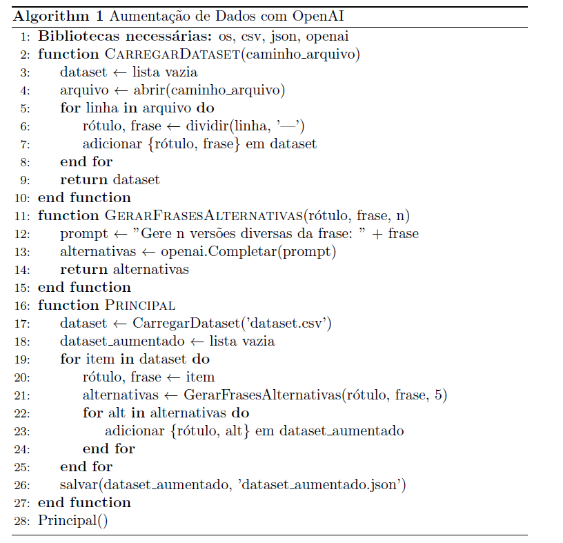

_Algoritmo Data Augmentation: Pseudo código da implementação do aumento de dados._

### Ferramentas e Bibliotecas

Para realizar o DA, foi utilizado as seguintes ferramentas e bibliotecas:

**- TensorFlow e Keras**: Para a implementação e treinamento dos modelos de aprendizado de máquina.
**- NLTK:** Para a substituição de sinônimos e manipulação de texto.
**- APIs de Tradução:** Para a técnica de backtranslation.

Outras bibliotecas tmabém foram útilizadas, como o `os` que é usada para obter a chave da API da OpenAI a partir de variáveis de ambiente. A `csv` permite a leitura do dataset original a partir de um arquivo CSV, enquanto a `json` é utilizada para salvar o dataset aumentado em formato JSON. A `pydantic` é empregada para definir e validar modelos de dados, garantindo a estrutura correta das sentenças geradas.

### Impacto no Conjunto de Dados

- Após a aplicação das técnicas de DA, o conjunto de dados original foi aumentado significativamente. Especificamente, o número de exemplos de dados aumentou de - 505 para 5400 exemplos. Abaixo, fornecemos exemplos específicos de como os dados foram transformados:

- "Poxa, acabei esquecendo! Você sabe quanto tempo leva pro cartão que pedi hoje chegar?"
- "Ei, você consegue me dizer quando o cartão que encomendei hoje deve ser entregue?"
- "Poderia me informar quanto tempo leva para chegar meu cartão para eu realizar operações, por favor?"
- "Quanto tempo leva pra chegar o cartão?', 'Você sabe dizer qual é o prazo de entrega do cartão?"

## Análise Exploratória

A Análise Exploratória de Dados (EDA) foi realizada de forma detalhada e iterativa, aplicada ao contexto do Processamento de Linguagem Natural (PLN). Este procedimento teve como objetivo extrair informações relevantes do conjunto de dados, identificar padrões, validar hipóteses e formular novas questões, atividades fundamentais ao desenvolvimento de pipelines de processamento de dados, na engenharia de features e no treinamento de modelos de aprendizado de máquina.

## Conjunto de dados

O conjunto de dados empregado foi fornecido no formato CSV, pela empresa. Inicialmente, devido à presença de colunas contendo valores nulos e delimitadores especiais, optou-se por importar o arquivo no Google Sheets para normalização. Em seguida, o arquivo foi exportado novamente na extensão CSV original. Posteriormente, realizou-se uma comparação manual entre a versão original e a nova versão, garantindo-se a integridade das informações.

### Descrição

O dataset é composto por quatro colunas principais, descritas na Tabela 1:

| Nome da Coluna | Descrição                                                  | Tipo de Dado        | Exemplo                                                               |
| -------------- | ---------------------------------------------------------- | ------------------- | --------------------------------------------------------------------- |
| No             | Representa o Índice de cada linha, começando no número 1\. | Integer             | 1, 2, 3, ...                                                          |
| Intenção       | O propósito ou objetivo implícito em uma pergunta.         | Categórico (String) | 'Compra', 'Suporte', etc.                                             |
| Pergunta       | A questão formulada pelo cliente.                          | String              | 'Como faço para mudar minha senha?'                                   |
| Resposta       | A resposta fornecida pelo atendente à pergunta.            | String              | 'Você pode mudar sua senha acessando as configurações do seu perfil.' |

_Tabela 1: Descrição dos elementos do dataset e suas características._

## Ferramentas e bibliotecas

Para a realização da exploração dos dados, foi utilizada a linguagem de programação Python, na versão 3.10.12. O ambiente de desenvolvimento Google Collaboratory foi escolhido devido à sua facilidade de uso, que permite a execução do código, testes e documentação de maneira integrada.

As bibliotecas empregadas neste escopo foram:

- **Spacy (versão 3.4.1)**: Aplicada em processos de tokenização, lematização e extração de entidades nomeadas (Honnibal; Montani, 2015).
- **Pandas (versão 1.5.3)**: Ferramenta para a estruturação e manipulação dos dados tabulares, permitindo a organização eficiente dos dados para as análises subsequentes (pandas development team, 2021).
- **Matplotlib (versão 3.6.2)**: Empregada para a criação de gráficos e visualizações, facilitando a interpretação dos resultados obtidos através de representações gráficas (Hunter et al., 2022).
- **WordCloud (versão 1.8.1)**: exibição de nuvem de palavras de forma gráfica (Mueller, 2021).

## Etapas do processo

Nesta seção, serão apresentadas as etapas que compõem o processo de análise exploratória. A Figura 1 a seguir ilustra, de forma concisa, essas fases, que serão detalhadas posteriormente.

_Figura 1: Fluxograma do processo de análise exploratória e etapas._

**1\. Carregamento dos Dados e Observação Inicial** Na fase inicial, realizou-se o carregamento do conjunto de dados, seguido por uma inspeção preliminar das informações. Observou-se que havia colunas e linhas com valores nulos, o que poderia distorcer o processamento dos dados em etapas posteriores. Por isso, optou-se pela remoção de linhas e colunas, onde todos os dados eram classificados como nulos.

**2\. Limpeza dos Dados** A limpeza dos dados consistiu na remoção de colunas e linhas irrelevantes ou incompletas. Essa etapa foi necessária para garantir que apenas dados consistentes e completos fossem utilizados nas análises subsequentes.

**3\. Compreensão das Características dos Dados** Cada coluna foi cuidadosamente examinada, buscando-se entender o significado e a relevância das intenções e características específicas de cada variável.

**4\. Agrupamento por Colunas de Interesse** Para permitir uma avaliação mais precisa da distribuição de perguntas e respostas, optou-se por agrupar as linhas de acordo com a coluna `Intenção`. Para o estudo da distribuição de tokens, as linhas foram agrupadas pela combinação `(Intenção, Token)`. Já para as entidades, o agrupamento ocorreu com base nas colunas `(Intenção, Entidade)`.

**5\. Separação entre Perguntas e Respostas** Após a limpeza e a realização das primeiras inspeções, o processo foi subdividido em dois enfoques distintos: estudos centrados nas perguntas e avaliações direcionadas às respostas. Esta subdivisão foi feita para evitar a mistura de tokens e garantir um exame mais preciso e segmentado de cada grupo de dados.

**6\. Exibição de Gráficos Auxiliares** Para facilitar a interpretação dos resultados, foram gerados gráficos em formato de barras, nuvens de palavras, entre outros, utilizando a biblioteca Matplotlib.

_Figura 2: Nuvem de palavras originada a partir da tokenização da coluna "Perguntas"._

## Pipeline de Pré-processamento

O pré-processamento de texto é uma etapa essencial no desenvolvimento de chatbots com Processamento de Linguagem Natural (NLP), pois permite a transformação dos dados brutos em um formato adequado para modelos de aprendizado de máquina. O objetivo principal do pré-processamento é melhorar a qualidade dos dados, reduzir ruídos e normalizar o texto para facilitar a análise.

A pipeline de pré-processamento foi implementada utilizando duas bibliotecas populares para NLP: SpaCy (Spacy, 2015) e NLTK (Natural Language Toolkit, 2001). Ambas oferecem ferramentas robustas para manipulação de texto, incluindo tokenização, remoção de stopwords, lematização e stemming, entre outras etapas de processamento.

Além disso, o código foi desenvolvido de forma flexível, permitindo a adição de novos passos de pré-processamento de maneira simplificada. Isso é possível graças a uma arquitetura modular, onde cada passo do processo é implementado como uma classe separada que pode ser facilmente integrada ao pipeline. A implementação do pipeline também inclui testes de unidade e integração para assegurar que cada componente funcione corretamente.

## Etapas do Pipeline de Pré Processamento

Apesar de diversas implementações e métodos terem sido testados, nem todos os passos foram utilizados no processamento final dos dados. A seguir, são apresentados apenas os passos que se mostraram eficazes na pipeline de pré-processamento para trasformação dos dados de entrada.

### 1. Limpeza dos dados

A primeira etapa do pipeline é a limpeza dos dados, cujo objetivo é remover elementos que não agregam ao sentido semântico do texto. Assim, todos os dígitos numéricos são removidos usando expressões regulares, e a pontuação é eliminada, pois não tem impacto relevante no significado. Esse processo garante que o texto esteja livre de ruídos que possam atrapalhar o desempenho do modelo.

### 2. Normalização

Após a limpeza, o passo seguinte é a normalização dos dados. Nesta etapa, todos os caracteres são convertidos para minúsculas para assegurar consistência na formatação das palavras, evitando a duplicação de tokens devido a diferenças de capitalização.

### 3. Tokenização

Com os dados limpos e normalizados, a tokenização é realizada, consistindo basicamente em segmentar o texto em unidades menores chamadas tokens, que podem ser palavras ou frases (Grefenstette, 1999). Essa etapa é essencial porque permite que o modelo de NLP processe o texto de forma mais granular e precisa, facilitando a análise das palavras individualmente, suas interações, e viabilizando outras etapas de pré-processamento, como stemming e lematização.

### 4. Remoção de Stop Words

Com o texto original segmentado em tokens, segue-se para a etapa de remoção de stop words. As stop words são palavras comuns que geralmente não carregam muito significado semântico, como "e", "ou", "é". Essas palavras são removidas do texto para reduzir a dimensionalidade e focar nas palavras de maior relevância (Rosenberg, 2014). Isso ajuda o modelo a ser computacionalmente mais eficiente e qualitativamente mais preciso.

### 5. Identificação de tokens relevantes

Utilizando a técnica de TF-IDF, são identificadas as palavras mais relevantes para cada classe de intenção. Essas palavras relevantes, tratadas como _main words_ no código, são utilizadas nos passos a seguir.

### 6. Correção ortográfica dos tokens relevantes

Após a remoção de palavras irrelevantes (stop words), são identificados os tokens que não estão contidas no dicionário de Português Brasileiro. Se um token não está contido, é calculada a Distância de Levenshtein com cada uma das _main words_ (descritas no passo anterior). Se a distância for pequena, o token é substituído pela palavra relevante.

Segue, abaixo, na Figura 3 que ilustra o pipeline de pré-processamento descrito.

_Figura 3: Fluxograma que ilustra as etapas do pipeline de pré-processamento de dados de texto para chatbot de atendimento ao cliente utilizando NLP, incluindo limpeza, normalização, tokenização, remoção de stopwords, stemming e lematização._

## Modelos baseline

Nesta seção, são introduzidos os algoritmos Naive Bayes e Support Vector Machines (SVM) como modelos baseline utilizados neste estudo, que serve como referência para a avaliação dos métodos e modelos propostos. O modelo foi escolhido por ser uma técnica rápida, de fácil implementação e bem estabelecida em tarefas de classificação de texto (Kamran Kowsari et al., 2019). As versões avaliadas incluem o Naive Bayes Multinomial, Naive Bayes Gaussiano, Naive Bayes Complement, e Support Vector Machine.

Como técnica de representação de texto, foi utilizada a abordagem Bag of Words (BoW), que converte os textos em vetores numéricos contendo a frequência das palavras. Parte da implementação dos modelos foi realizada a partir de bibliotecas existentes, garantindo a reprodutibilidade e eficiência do processo. No entanto, algumas funcionalidades foram implementadas manualmente para assegurar um maior controle sobre as etapas do processo e permitir uma personalização mais fina dos algoritmos. A seguir, são detalhados em ordem, a construção do vocabulário, a transformação dos textos em vetores BoW, a criação de vetores BoW para textos únicos e a aplicação do algoritmo Naive Bayes.

### Bag of Words (BoW)

Bag of Words (BoW) é uma técnica de processamento de linguagem natural que transforma o texto em uma representação numérica. Neste modelo, cada documento é representado como um vetor de palavras, onde cada palavra é um elemento do vetor. A frequência de cada palavra é contada e usada como valor no vetor. O BoW é uma abordagem simples e eficaz para a representação de texto, mas não leva em consideração a ordem das palavras (Murphy, 2022, p. 24).
No contexto do modelo proposto, esta técnica foi utilizado para converter as interações textuais dos usuários em vetores numéricos que servem como entrada para os modelos de aprendizado de máquina subsequentes.

#### Construção do Vocabulário

A construção do vocabulário segue como o primeiro passo no processo de BoW. Ela envolve a coleta de todas as palavras únicas que aparecem nos textos de entrada e a criação de um índice que mapeia cada palavra a uma posição no vetor. Esse vocabulário é então usado para construir vetores BoW para cada texto, onde cada posição do vetor indica a frequência de uma palavra específica no texto.

##### Algoritmo 1: Construção do Vocabulário

O processo de construção do vocabulário pode ser descrito na figura 4, que percorre cada texto da base de dados, extrai as palavras, elimina duplicatas e as ordena em um vocabulário final. Esse vocabulário é então utilizado para indexar as palavras e preparar a transformação dos textos em vetores BoW.

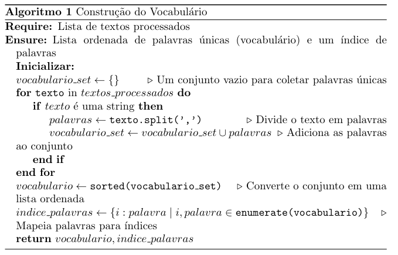

_Figura 4: Algoritmo 1 - Construção do Vocabulário utilizado no modelo BoW._

##### Algoritmo 2: Transformação de Textos em Vetores BoW

A figura 5 detalha o processo de transformação dos textos em vetores BoW. O algoritmo utiliza o vocabulário previamente construído para mapear as palavras de cada texto às suas respectivas posições no vetor, preenchendo as frequências correspondentes.

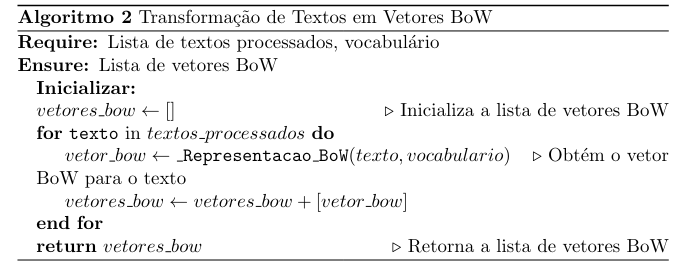

_Figura 5: Algoritmo 2 - Transformação de Textos em Vetores BoW._

#### Criação de Vetores BoW para Textos Únicos

A criação do vetor BoW para um texto específico envolve a contagem da ocorrência de cada palavra do vocabulário dentro desse texto e o preenchimento do vetor correspondente. Esse vetor é então utilizado como entrada para os modelos de aprendizado de máquina que realizarão as tarefas de classificação ou previsão.

##### Algoritmo 3: Criação de um Vetor BoW para um Texto Único

A figura 6 ilustra a criação de um vetor BoW para um único texto, utilizando o vocabulário pré-definido. Cada palavra do texto é contada e sua frequência é registrada no vetor de acordo com a posição correspondente no vocabulário.

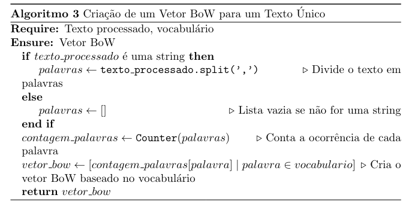

_Figura 6: Algoritmo 3 - Criação de um Vetor BoW para um Texto Único._

### Naive Bayes

Naive Bayes é uma família de algoritmos de aprendizado supervisionado baseados no teorema de Bayes. Esses algoritmos são amplamente utilizados em tarefas de classificação, especialmente quando as características dos dados são representadas por variáveis categóricas ou contínuas. A suposição central do modelo é a independência condicional entre as características, o que simplifica o cálculo das probabilidades e permite uma classificação eficiente mesmo em grandes volumes de dados (Lantz, 2023, p. 117).

#### Naive Bayes Multinomial

O algoritmo Naive Bayes Multinomial é uma variante do classificador Naive Bayes que modela as características utilizando a distribuição multinomial (Equação 2), sendo particularmente eficaz na classificação de dados textuais. A equação 1 apresenta a fórmula do classificador com suavização de Laplace e log-probabilidades.

$$
c_{map} = \underset{c \in C}{\mathrm{argmax}} \left[ \log \hat{P}(c) + \sum_{1 \leq k \leq n_d} \log \hat{P}(t_k | c) \right]
$$

$$
\text{Equação 1: Fórmula do classificador Naive Bayes Multinomial com suavização de Laplace e log-probabilidades.}
$$

$$
p(x_1, x_2, \dots, x_k) = \frac{n!}{x_1! \cdot x_2! \cdots x_k!} \cdot p_1^{x_1} \cdot p_2^{x_2} \cdots p_k^{x_k}
$$

$$
\text{Equação 2: Fórmula da distribuição multinomial.}
$$

##### Implementação

A implementação do classificador Naive Bayes no seu formato Multinomial foi realizada tomando como base os conceitos apresentados em Manning et al. (2009). O processo é dividido entre o cálculo das probabilidades a priori e as probabilidades condicionais (Equação 1), referentes à frequência de ocorrência de cada palavra em cada classe (Equação 3). A partir dessas probabilidades, é possível realizar a classificação de novos documentos com base na probabilidade de pertencer a cada classe e na ocorrência de suas palavras.

$$
P(X_i \mid C_j) = \frac{\text{Number of documents of class } C_j \text{ that contain the word } X_i}{\text{Number of documents of class } C_j}
$$

$$
\text{Equação 3: Fórmula da probabilidade condicional no Naive Bayes Multinomial.}
$$

###### Algoritmo 4: Treinamento do Modelo Naive Bayes Multinomial

A Figura 7 apresenta o algoritmo desenvolvido para o treinamento do modelo Naive Bayes Multinomial. Este algoritmo é responsável por calcular as probabilidades a priori das classes e as probabilidades condicionais dos termos no vocabulário, considerando a distribuição dos dados.

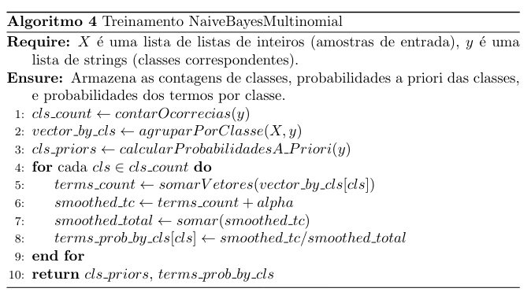

_Figura 7: Algoritmo 4 - Treinamento do Modelo Naive Bayes Multinomial_

###### Algoritmo 5: Aplicação do Modelo Naive Bayes Multinomial

A Figura 8 ilustra o procedimento de aplicação do modelo treinado para a classificação de novos documentos. Este processo envolve o cálculo das pontuações para cada classe, dado uma lista de vetores (Bag of words) de entrada, utilizando as probabilidades previamente computadas. A classe com a maior pontuação é então atribuída aos documentos, completando o processo de classificação.

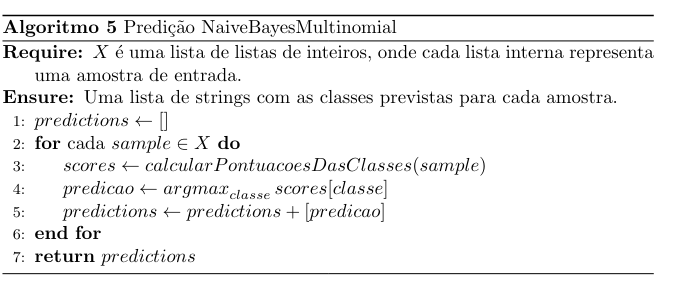

_Figura 8: Algoritmo 5 - Aplicação do Modelo Naive Bayes Multinomial_

###### Suavização de Laplace e Log-Probabilidades

Para mitigar o problema das probabilidades nulas, foi empregada a suavização de Laplace, que adiciona um valor constante $\alpha$ a todas as contagens de palavras (Lantz, 2023, p. 120-121). Além disso, as probabilidades foram transformadas em log-probabilidades, convertendo o produto das probabilidades em uma soma de logaritmos, o que ajuda a evitar problemas de underflow numérico. A Equação 4 apresenta a fórmula da suavização de Laplace.

$$
P(X_i \mid C_j) = \frac{\text{Número de documentos pertencentes à classe } C_j \text{ que contém a palavra } X_i + \alpha}{\text{Número de documentos pertencentes à classe } C_j + (\alpha \cdot n)}
$$

$$
\text{Equação 4: Fórmula da suavização de Laplace.}
$$

### Outros Modelos Implementados

Na sequência do Naive Bayes Multinomial, são apresentadas as abordagens utilizadas para as outras variantes do classificador Naive Bayes: Gaussiano e Complement, Além do modelo SVM. Os modelos mencionadas foram implementadas utilizando a biblioteca sklearn (Pedregosa et al., 2011). Essas variantes foram escolhidas para explorar diferentes características dos dados e testar a eficácia de cada uma no escopo de classificação de intenções, presentes no dataset fornecido.

#### Naive Bayes Gaussiano

Este classificador calcula as probabilidades condicionais baseando-se na distribuição Gaussiana, sendo adequado para tarefas onde as características têm valores contínuos (Esposito; Esposito, p. 224). No contexto de classificação de texto, o Naive Bayes Gaussiano foi aplicado a características numéricas derivadas de representações vetoriais de texto, sendo a primeira abordagem baseada em BoW, e a segunda em Word2Vec.

#### Naive Bayes Complement

Construido com o objetivo de lidar com conjuntos de dados desbalanceados, o Naive Bayes Complementar ajusta as probabilidades considerando a complementaridade das classes. Essa abordagem ajuda a mitigar o impacto de classes minoritárias ao calcular as probabilidades a partir do complemento das classes alvo, garantindo uma maior robustez do modelo em cenários onde o desequilíbrio de classes é significativo (Rennie et al., 2003).

#### Support Vector Machines (SVM)

O algoritmo Support Vector Machine (SVM) é utilizado para tarefas de classificação e regressão, sendo eficaz tanto em dados lineares quanto não lineares. Ele busca construir um hiperplano que maximize a margem entre as classes, proporcionando uma separação mais eficiente dos dados. O SVM tem aplicações em diversas áreas, como a classificação de textos, porém, à medida que o volume de dados cresce, a complexidade do modelo aumenta, impactando o tempo de treinamento e o consumo de recursos computacionais (Lantz, 2023, p. 294-295).

### Treinamento com CPU e GPU

O modelo baseline, implementado utilizando o algoritmo Naive Bayes, foi treinado tanto em CPU quanto em GPU para fins de comparação de desempenho entre diferentes ambientes de execução. Para o treinamento em CPU, foi utilizada uma configuração padrão disponível no ambiente do Google Colab, aproveitando a capacidade de processamento sequencial da unidade central de processamento. Em contraste, o treinamento em GPU foi realizado utilizando uma máquina equipada com a GPU A100, também disponível no Google Colab, que permite a execução paralela de operações, especialmente vantajosa em tarefas envolvendo grandes volumes de dados e complexidade computacional.

Além da implementação inicial do modelo baseline em CPU utilizando as bibliotecas tradicionais do Python e Numpy, o modelo foi reimplementado utilizando a biblioteca CuPy para o treinamento na GPU. CuPy é uma biblioteca que permite a execução de operações numéricas com uma sintaxe semelhante à do NumPy, mas aproveitando a aceleração via GPU. Essa reimplementação foi realizada para otimizar ainda mais o processo de treinamento na GPU, visando explorar o potencial máximo da GPU A100 disponível no Google Colab e reduzir o overhead de transferência de dados.

## Modelo Word2Vec

Após o processo de pré-processamento das palavras das sentenças na base de dados, foi realizada a vetorização das palavras. Essa etapa é fundamental, pois não só permite a entrada das palavras na rede neural, mas também facilita a extração de informações essenciais sobre as palavras, que contribuem significativamente para o desempenho do modelo.

A técnica de vetorização utilizada é conhecida como "Word Embedding". Esse método converte cada palavra de uma frase em um vetor, onde cada elemento do vetor representa uma dimensão que reflete aspectos semânticos, sintáticos e morfológicos da palavra. Tal abordagem é especialmente vantajosa pela sua capacidade de capturar informações complexas das palavras no contexto (Hartmann et al., 2017).

No contexto deste trabalho, foi empregado o modelo pré-treinado com o algoritmo Word2Vec utilizando a técnica Skip-Gram, na qual o modelo recebe uma palavra e tenta prever suas palavras vizinhas. Essa técnica é particularmente eficaz e é composta por uma única matriz de pesos, além dos embeddings de palavras (Hartmann et al., 2017).

O modelo pré-treinado de Word2Vec, desenvolvido por (Hartmann et al., 2017), foi treinado em diversos corpora que englobam diferentes contextos e variações do português falado no Brasil e em países europeus, totalizando 1.395.926.282 tokens. Cada palavra é representada por um vetor de 300 dimensões, o que facilita uma representação mais rica e completa das palavras.

Aplicado a um conjunto de dados contendo 5.100 amostras, após a aplicação de data augmentation utilizando uma Large Language Model (LLM) do ChatGPT (ChatGPT, 2023) para a geração de novos dados para enriquecer os 433 amostras, o modelo Word2Vec foi utilizado para calcular a média dos vetores que representam as palavras de cada frase, gerando uma representação vetorial da sentença para entrada na rede neural. Esse processo está ilustrado na Figura 9, que detalha a transformação do conjunto de dados para adequação ao modelo de rede neural.

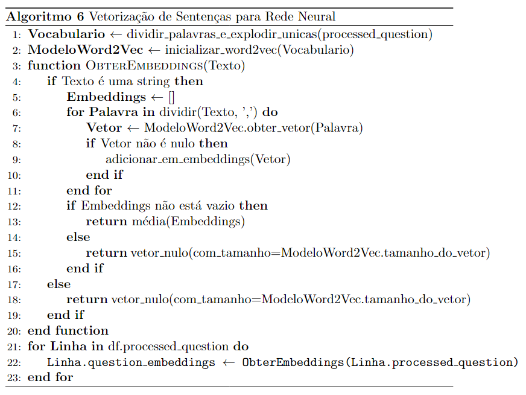

_Figura 9: Uso do modelo pré-treinado do Word2Vec sob a base de dados._

Portanto, conforme ilustrado na Figura 9, que demonstra a aplicação do modelo a cada palavra em uma sentença, seguida pela média desses vetores para a construção de uma representação vetorial da frase. Na próxima seção, será demonstrado o modelo classificador em detalhe, com ênfase em suas configurações.

## Modelo de Rede Neural

Primeiramente, após o processo de vetorização da base de dados, os vetores resultantes foram preparados para entrada na rede neural. O objetivo da rede neural, neste contexto, é classificar sentenças com base em sua compreensão, retornando assim a intenção correspondente. Nesta seção, serão discutidos os processos iniciais, os hiperparâmetros e a arquitetura utilizada.

Ademais, o conjunto de vetores representando cada sentença foi dividido em dados de treino e teste, sendo 70% dos dados destinados ao treino e 30% ao teste. O modelo foi construído usando a biblioteca open-source TensorFlow (TensorFlow, 2015) com Keras (Keras, 2015) e foi treinado para classificar um total de 18 intenções.

Para maximizar a performance do modelo, foram aplicadas técnicas de regularização, como Early Stopping e Dropout. O Early Stopping monitora o treinamento do modelo a partir do valor da perda no conjunto de validação, interrompendo o treinamento quando o desempenho começa a piorar, o que ajuda a evitar overfitting (Gerón, 2019, p. 112). Por outro lado, o Dropout desativa aleatoriamente uma fração dos neurônios durante o treinamento, aumentando a capacidade de generalização do modelo (Gerón, 2019, p. 281).

A seguir, a Tabela 2 descreve brevemente os hiperparâmetros utilizados:

| **Hiperparâmetro**       | **Valor**                | **Descrição**                                                                                                                                                                                    |
| ------------------------ | ------------------------ | ------------------------------------------------------------------------------------------------------------------------------------------------------------------------------------------------ |
| **Função de Perda**      | categorical_crossentropy | A função de perda "categorical crossentropy" é utilizada para problemas de classificação multiclasse, onde o objetivo é minimizar a diferença entre as previsões do modelo e as classes reais.   |
| **Otimizador**           | adam                     | O otimizador "Adam" combina as vantagens dos algoritmos de otimização AdaGrad e RMSProp, proporcionando uma convergência eficiente e estável.                                                    |
| **Tamanho de Batch**     | 32                       | O tamanho do batch define o número de amostras processadas antes de atualizar os parâmetros do modelo. Um batch size de 32 equilibra a estabilidade do treinamento e a eficiência computacional. |
| **Quantidade de Épocas** | 100                      | O número de épocas refere-se à quantidade de vezes que o algoritmo de treinamento percorre todo o conjunto de dados. Cem épocas permitem um ajuste fino do modelo aos dados de treinamento.      |

_Tabela 2: Descrição breve dos hiperparâmetros que compõem o modelo de classificação de intenções._

A Tabela 2 apresenta os hiperparâmetros escolhidos para impulsionar o modelo na busca por uma convergência eficiente e uma capacidade de generalização robusta.

Em seguida, é importante destacar a simplicidade da arquitetura utilizada no classificador, o que contribuiu para alcançar boas métricas de desempenho. De acordo com os estudos comparativos de modelos propostos por (Attigeri; Agrawal e Kolekar ,2024), o modelo que apresentou o melhor resultado para a classificação de intenções foi o "Hercules", uma arquitetura contendo três camadas principais (entrada, intermediária e saída) intercaladas com Dropout de 50%. A partir desse estudo, enfatiza-se a importância da simplicidade na arquitetura do modelo, mantendo um equilíbrio entre complexidade e eficiência.

O modelo desenvolvido para este trabalho segue essa linha, conforme descrito na Tabela 3:

| **Camada**    | **Tipo** | **Neurônios** | **Ativação** | **Descrição**                                                                                           |
| ------------- | -------- | ------------- | ------------ | ------------------------------------------------------------------------------------------------------- |
| **Hidden 1**  | Dense    | 128           | ReLU         | Camada densa com 128 neurônios. A função **ReLU** ajuda a capturar relações não lineares nos dados.     |
| **Dropout 1** | Dropout  | -             | -            | Desativa 50% dos neurônios da camada anterior, prevenindo overfitting.                                  |
| **Hidden 2**  | Dense    | 64            | ReLU         | Segunda camada densa com 64 neurônios. Novamente, **ReLU** para continuar a modelar relações complexas. |
| **Dropout 2** | Dropout  | -             | -            | Desativa 50% dos neurônios, contribuindo para a regularização.                                          |
| **Output**    | Dense    | 18            | Softmax      | Camada de saída com softmax, convertendo as saídas em probabilidades para cada classe.                  |

_Tabela 3: Representação da arquitetura que compõem o modelo classificador de intenções._

A Tabela 3 ilustra a arquitetura adotada, que se assemelha ao modelo "Hercules" pela utilização de um número reduzido de camadas intercaladas com Dropout como técnica de regularização.

## Modelo LSTM

O modelo utilizado foi uma Rede Neural Recorrente do tipo Long Short-Term Memory (LSTM), ideal para capturar dependências contextuais em sequências de texto, o que é essencial para a classificação de intenções em interações de atendimento ao cliente.

### Arquitetura do Modelo

- **Camada Embedding**: Converte palavras em vetores de densidade reduzida que capturam as relações semânticas entre elas.
- **Camada LSTM**: Com 128 unidades, responsável por processar as sequências de vetores de palavras, capturando dependências contextuais e temporais nas interações.
- **Dropout**: Aplicado após a camada LSTM com um valor de 50%, visando prevenir overfitting ao desativar aleatoriamente uma fração dos neurônios durante o treinamento.
- **Camada Densa**: Com ativação `ReLU`, para processar as representações aprendidas e reduzir a dimensionalidade.
- **Camada de Saída**: Uma camada densa com ativação `Softmax`, que gera as probabilidades de cada intenção possível.

### Hiperparâmetros e Configuração de Treinamento

- **Função de Perda**: `categorical_crossentropy`, adequada para problemas de classificação multiclasse.
- **Otimizador**: `adam`, que proporciona uma convergência estável e eficiente.
- **Tamanho do Batch**: 32, escolhido para balancear eficiência computacional e estabilidade no treinamento.
- **Épocas**: 100, permitindo que o modelo refine suas previsões ao longo de múltiplas iterações.

### Avaliação do Modelo

A avaliação do modelo foi realizada utilizando um conjunto de métricas robustas para garantir uma análise abrangente de sua performance:

- **Acurácia**: Medida da proporção de previsões corretas em relação ao total de previsões.
- **Precisão e Recall**: Avaliaram a capacidade do modelo de prever corretamente as intenções e a sensibilidade na detecção de cada classe.
- **F1-Score**: Combinou precisão e recall para fornecer uma métrica balanceada do desempenho.
- **Matriz de Confusão**: Utilizada para identificar as áreas de confusão entre as diferentes classes de intenções, auxiliando na compreensão dos padrões de erro do modelo.

### Treinamento com CPU e GPU

O treinamento foi conduzido tanto em ambientes de CPU quanto GPU, para avaliar o impacto do processamento paralelo no tempo de execução. Utilizamos o TensorFlow com suporte a cuDNN para acelerar operações matemáticas em GPU, proporcionando um ambiente otimizado para o treinamento do modelo LSTM.

## Modelo LLM

A Geração de Linguagem Natural (NLG) tem como principal objetivo criar textos automaticamente, convertendo dados ou informações estruturadas em linguagem humana (Dong, 2021). Ela é amplamente utilizada para gerar respostas ou conteúdos que imitam a forma como as pessoas escrevem ou falam, como em chatbots.

No caso deste estudo, o modelo utilizado foi o Llama (versão 3.1 8B), escolhido para a geração de texto após a análise de intenção, devido à sua capacidade de adaptar-se a diferentes domínios. Este modelo open-source destaca-se entre outros modelos de múltiplos propósitos, como GPT-4 e GPT-5, oferecendo flexibilidade e personalização para atender às necessidades específicas da base de dados da Brastel. Com um treinamento robusto de 15 trilhões de tokens e uma infraestrutura composta por 16.000 GPUs do tipo H100, o Llama 3.1 8B é ideal para aplicações que exigem desempenho e eficiência (Meta, 2024). A versão instruída do modelo permite o fine-tuning, ajustando-o às particularidades do domínio da base de dados da Brastel.

A arquitetura do modelo pré-treinado é do tipo decoder-only, o que visa maximizar a estabilidade do treinamento e a eficiência na geração de texto. Essa estrutura permite que o modelo se concentre unicamente na tarefa de previsão da próxima palavra em uma sequência, sem a necessidade de processar informações contextuais anteriores, o que simplifica o treinamento e potencializa a performance em aplicações de geração de linguagem (Meta, 2024).

### Componentes do Modelo

Na Tabela 4, será mostrado aspectos que residem no modelo visando eficiência e simplicidade quanto ao uso de memória, considerando a precisão do modelo:

| **Componente**              | **Descrição**                                                                                                                 |
| --------------------------- | ----------------------------------------------------------------------------------------------------------------------------- |
| **Camadas de Transformer**  | O modelo possui 32 camadas de Transformer, cada uma composta por mecanismos de atenção.                                       |
| **Multi-Head Attention**    | Com 32 cabeças de atenção, o modelo capta diferentes relações e dependências dentro do texto.                                 |
| **Camada Feedforward**      | Cada camada de Transformer é seguida por uma rede neural feedforward com uma dimensão de FFN de 14.336.                       |
| **Função de Ativação**      | Utiliza a função de ativação SwiGLU, que melhora o fluxo de informações entre as camadas.                                     |
| **Parâmetros**              | Com 8 bilhões de parâmetros, o modelo captura nuances e padrões nos dados textuais.                                           |
| **Instruções Llama 3.1 8B** | A versão instruída do modelo permite o fine-tuning, ajustando-o às particularidades da base de dados.                         |
| **Quantização**             | A quantização de 16 bits para 4 bits minimiza o uso de memória e a necessidade de infraestrutura robusta.                     |
| **QLoRA**                   | Técnica de Quantization-aware Low-Rank Adaptation que oferece economias substanciais de memória.                              |
| **Gerenciamento de GPU**    | Com 5.4 GB de tamanho no modelo, otimizado para um gerenciamento eficiente da GPU, proporcionando um treinamento mais rápido. |
| **Janela de Contexto**      | Possui uma janela de contexto de 2048 tokens, permitindo processar informações extensas em sequências.                        |

_Tabela 4: Descrição breve dos componentes usadas para performance do modelo Llama 3.1 8B._

A Tabela 4 resume os principais componentes do modelo, destacando sua eficiência e simplicidade no uso de memória, sem perder precisão. Cada elemento, desde as camadas de Transformer até as técnicas de quantização, foi projetado para otimizar o desempenho e permitir um treinamento ágil, capturando nuances importantes nos dados textuais.

### Hiperparâmetros e Configuração de Treinamento

Na Tabela 5 são mostrados os hiperparâmetros utilizados no treinamento:

| **Hiperparâmetro**      | **Valor**   |
| ----------------------- | ----------- |
| **Tamanho do Batch**    | 8           |
| **Taxa de Aprendizado** | 3e-4        |
| **Épocas**              | 30          |
| **Otimização**          | AdamW 8-bit |

_Tabela 5: Descrição breve dos hiperparâmetros que compõem o modelo de geração de texto._

A Tabela 5 mostra os hiperparâmetros utilizados no treinamento do modelo de geração de texto. Esses parâmetros são essenciais para otimizar o desempenho e garantir a eficácia do treinamento.

### Abordagem RAG

A técnica de Retrieval-Augmented Generation (RAG) combina a recuperação de informações com a geração de respostas em linguagem natural (Lewis et al., 2021). No caso, utilizando o FAQ da Brastel, as perguntas e respostas são convertidas em vetores numéricos, facilitando a busca eficiente por dados relevantes.

Quando um usuário faz uma pergunta, o sistema de armazenamento vetorial ChromaDB identifica as respostas mais apropriadas a partir desses vetores. Em seguida, o modelo de geração de texto utilizado proporciona uma resposta clara e contextualizada, integrando as informações recuperadas. Essa abordagem permite que as respostas sejam rápidas, precisas e diretamente relacionadas à consulta do usuário mitigando a possibilidade do modelo alucinar.

### Avaliação do Modelo

Como abordagem, foi escolhida a avaliação baseada em inferência para testar o desempenho do modelo, pois ela permite observar diretamente como o modelo responde a um input específico, simulando interações reais. Essa abordagem é útil para avaliar a capacidade do modelo de gerar respostas coerentes e contextualmente apropriadas. Em vez de depender exclusivamente de métricas, como acurácia, recall e precisão, a inferência oferece uma maneira mais prática de verificar o funcionamento do modelo em situações em que é necessário fornecer respostas a perguntas ou comandos.

### Treinamento com GPU

O treinamento foi realizado utilizando GPUs A100 e T4, com o objetivo de maximizar o desempenho do modelo em ambientes de alta performance. Embora a GPU A100 tenha proporcionado um processamento robusto, o uso da T4 enfrentou algumas limitações devido à menor quantidade de memória RAM disponível, o que restringiu a capacidade de realizar o fine-tuning com a mesma eficiência. Dessa forma, a escolha das GPUs foi feita de forma estratégica para balancear o desempenho e os recursos disponíveis durante o treinamento.

## Métricas de avaliação

As métricas de avaliação são fundamentais para entender o desempenho de um modelo de aprendizado de máquina, especialmente em tarefas de classificação. Elas fornecem diferentes perspectivas sobre como o modelo está funcionando, permitindo uma análise detalhada das suas capacidades e limitações. Ao aplicar essas métricas, é possível determinar não apenas o número de acertos e erros, mas também a qualidade das previsões, a capacidade do modelo de identificar corretamente as classes de interesse e o equilíbrio entre a detecção de verdadeiros positivos e a minimização de falsos positivos e negativos. A escolha das métricas mais adequadas depende do contexto da aplicação e dos objetivos específicos do modelo, sendo essencial para a interpretação correta dos resultados e para a tomada de decisões informadas sobre possíveis ajustes e melhorias no modelo.

Nas seções subsequentes, será apresentado um panorama das métricas utilizadas para avaliar a performance do modelo, com explicações baseadas em estudos de (Géron, 2017, pp. 73–75).

### Acurácia

Acurácia é uma métrica de avaliação que indica a proporção de previsões corretas feitas pelo modelo em relação ao total de previsões. Em um modelo de classificação de intenção, a acurácia é útil para obter uma visão geral de quão bem o modelo está identificando as intenções dos usuários. Ela responde à pergunta: "Qual a porcentagem de vezes que o modelo classificou corretamente as intenções dos usuários, considerando todas as possíveis classes de intenção?" Embora seja uma medida global, é importante lembrar que em um cenário de classificação de intenção, onde algumas intenções podem ser muito mais comuns que outras, a acurácia sozinha pode não ser suficiente para avaliar o desempenho real do modelo.

$Acurácia = \frac{TP + TN} {TP + TN + FP + FN}$

Onde:

- $TP =$ Verdadeiros positivos
- $TN =$ Verdadeiros negativos
- $FP =$ Falsos positivos
- $FN =$ Falsos negativos

### Precisão

Precisão mede a proporção de verdadeiros positivos em relação ao número total de instâncias que o modelo previu como pertencentes a uma classe específica. Em um modelo de classificação de intenção, a precisão é crítica quando o objetivo é garantir que, ao prever uma determinada intenção, o modelo esteja fazendo isso com alta certeza. Isso é especialmente relevante em situações onde uma previsão incorreta pode levar a uma ação inadequada ou resposta errada para o usuário. A precisão responde à pergunta: "Das vezes que o modelo previu uma intenção específica, com que frequência ele estava certo?" Assim, a precisão ajuda a evitar falsos positivos, o que é vital para garantir que as previsões do modelo sejam confiáveis.

$Precisão = \frac {TP} {TP + FP}$

Onde:

- $TP =$ Verdadeiros positivos
- $FP =$ Falsos positivos

### Recall

Recall, ou sensibilidade, mede a capacidade do modelo de encontrar todas as instâncias reais de uma intenção específica dentro do conjunto de dados. Em um cenário de classificação de intenção, o recall é particularmente importante quando é crucial identificar todas as ocorrências de uma determinada intenção, mesmo que isso signifique aceitar um maior número de falsos positivos. Por exemplo, se o modelo está sendo utilizado para detectar intenções críticas, como "Acesso a conta", é essencial que todas essas intenções sejam identificadas para evitar a insatisfação do usuário. O recall, portanto, responde à pergunta: "Das instâncias que realmente pertencem a uma intenção específica, quantas foram corretamente identificadas pelo modelo?"

$Recall = \frac {TP} {TP + FN}$
Onde:

- $TP =$ Verdadeiros positivos
- $FN =$ Falsos negativos

### F1-Score

F1 Score é a média harmônica entre precisão e recall, combinando essas duas métricas em uma única medida que equilibra a importância de ambas. No contexto de um modelo de classificação de intenção, o F1 Score é especialmente útil quando há um desbalanceamento entre diferentes intenções ou quando tanto a precisão quanto o recall são importantes. Por exemplo, em um cenário onde é igualmente importante minimizar falsos positivos e garantir que todas as intenções críticas sejam capturadas, o F1 Score fornece uma avaliação equilibrada do desempenho do modelo. Ele responde à pergunta: "Como o modelo performa em termos de precisão e recall, considerando as implicações de cada uma dessas métricas na identificação de intenções?"

$F1Score = 2 \times \frac {Precisão \times Recall} {Precisão + Recall}$

### Matriz de confusão

Matriz de confusão é uma ferramenta que organiza as previsões do modelo em uma tabela, permitindo a visualização detalhada de como o modelo classifica as intenções. Em um modelo de classificação de intenção, a matriz de confusão é extremamente valiosa para entender os padrões de erro, como quais intenções são frequentemente confundidas com outras. Isso ajuda a identificar se o modelo tem dificuldades específicas em distinguir entre intenções semelhantes ou se está superestimando ou subestimando certas classes. A matriz de confusão, portanto, permite ajustes mais precisos na modelagem, garantindo que o modelo melhore sua capacidade de classificar corretamente as intenções dos usuários.

# Resultados

## Resultados do pré-processamento

### Comparação de Frases Antes e Depois do Pré-Processamento

A tabela a seguir ilustra exemplos específicos de perguntas que foram submetidas ao pipeline de pré processamento, passando pelo processo de limpeza, normalização, tokenização, remoção de stopwords e stemming. Como já ressltado, essa transformação é fundamental para preparar os dados textuais para análise, reduzindo o ruído e focando nas informações essenciais. A comparação evidencia esse argumento, ilustrando a redução do texto a suas formas mais relevantes, eliminando elementos que não agregam valor semântico significativo, como stopwords e pontuação.
Os exemplos abaixo foram extraídos da base de dados fornecida pelo parceiro.
| Pergunta Original | Pergunta Após Pré-Processamento |
|-----------------------------------------------------------------------------------|------------------------------------------------------------------------------------------------------------------|
| Boa tarde Gostaria de tirar uma dúvida Se eu mandar dinheiro hj chegará no Brasil hj mesmo? | [boa, tard, gost, tir, dúv, mand, dinh, hj, cheg, brasil, hj] |
| Quanto tempo levará para o beneficiário receber o dinheiro? | [quant, temp, lev, benefici, receb, dinh] |
| Bom dia como eu faço pra colocar o SSS beneficiário Pra enviar dinheiro no Brasil | [bom, dia, faç, pra, coloc, ss, benefici, pra, envi, dinh, brasil] |
| Boa tarde Equipe Tóquio. Por favor processar a remessa. | [boa, tard, equip, tóqui, favor, process, remess] |
| Fiz um depósito de ¥5,000 Qual o valor em reais?  Obrigada | [fiz, deposit, ¥, val, real, obrig] |
| Olá tudo bem, transferi um dinheiro do paypayginkou para essa conta mas não coloquei o número de identificação no do depósito, o que fazer? | [olá, tud, bem, transfer, dinh, paypaygink, cont, coloq, númer, identific, depósit, oqu, faz] |
| Boa tarde Enviar rs 2000 E rs 2500 quanto da yens | [boa, tard, envi, rs, rs, quant, yem] |
| Bom dia depositei ontem y59.000 quanto chega no Brasil :flag-br: já incluindo a taxa? Muito e uma semana abençoada para todos vocês com muita saúde! Obrigada :pray: | [bom, dia, deposit, ont, y, quant, cheg, brasil, :flag-br:, inclu, tax, seman, abenço, tod, muit, saúd, obrig, :pray:] |
| Bom dia, ontem eu recebi a notificação novamente que a remessa estava pendente e vi que o problema era porque eu coloquei o CPF errado, eu gostaria de cancelar a remessa pra mim reenviar novamente | [bom, dia, ont, receb, notific, nov, remess, pend, vi, problem, porqu, coloq, cpf, err, gost, cancel, remess, pra, mim, reenvi, nov] |
| Como faço para fazer depósito Já fiz o cadastro na Brastel remit | [faç, faz, depósit, fiz, cadastr, brastel, remit] |

_Tabela 6: Comparação entre as perguntas originais dos usuários e suas respectivas versões após o pré-processamento._

### Estatísticas dos Dados Pós-Processamento

Após a aplicação da pipeline de pré-processamento na base de dados, é fundamental analisar, por meio de visualizações e estatísticas, como os dados textuais foram transformados.

#### Análise de Frequência de Tokens Antes e Depois do Pré-Processamento

Uma das formas mais diretas de entender o impacto do pré-processamento é através da análise da frequência dos tokens, comparando as distribuições antes e depois da aplicação das etapas de pré-processamento.

Os gráficos a seguir apresentam os 10 tokens mais frequentes antes e depois do pré-processamento das perguntas dos usuários.

_Figura 10: Análise da frequência de tokens antes do pré processamento da base._

_Figura 11: Análise da frequência de tokens depois do pré processamento da base._

Antes do Pré-Processamento, como mostrado na Figura 10, os tokens mais comuns incluem palavras de alta frequência e baixa relevância semântica, como "de", "o", "para", além de sinais de pontuação como "?" e ",". Esses tokens são considerados stopwords e geralmente não adicionam valor ao entendimento do texto, indicando a presença de ruído significativo nos dados brutos.

Depois do Pré-Processamento, a Figura 11 revela uma transformação significativa na distribuição dos tokens. Palavras como "boa", "remess", "envi", e "dia" se destacam como as mais frequentes, refletindo o impacto da remoção de stopwords e da aplicação do stemming. Esse resultado mostra que o pré-processamento foi eficaz em filtrar o ruído e reduzir os tokens às suas formas mais informativas e relevantes para a análise semântica.

#### Contagem de Tokens Únicos Antes e Depois do Pré-Processamento

Além de analisar a frequência dos tokens, outra métrica importante é a contagem de tokens únicos na base de dados antes e depois do pré-processamento. O gráfico a seguir exibe essa métrica. Na Figura 12, vemos que o número de tokens únicos diminuiu significativamente após o pré-processamento, quase em 50%. Essa redução indica que o vocabulário foi simplificado, eliminando redundâncias e focando nas palavras que carregam o significado central, o que é essencial para reduzir a complexidade do modelo de NLP e melhorar a precisão, concentrando-se nas palavras importantes.

_Figura 12: Comparação de Tokens Únicos Antes e Depois do Pré-Processamento._

#### Comparação do Comprimento Médio das Sentenças Antes e Depois do Pré-Processamento

Na Figura 13, comparamos o comprimento médio das sentenças antes e depois do pré-processamento. Observa-se uma redução significativa no número médio de tokens por sentença, o que é mais um indicativo de que o pipeline de pré-processamento foi eficaz simplificar o texto e preparar a base para o treinamento posterior do modelo.

_Figura 13: Comparação do Comprimento Médio das Sentenças Antes e Depois do Pré-Processamento._

## Resultados de modelos de classificação

Nesta seção, são apresentados os resultados obtidos a partir dos modelos desenvolvidos para o chatbot de atendimento ao cliente, incluindo o modelo baseline com Bag of Words (BoW) utilizando Naive Bayes e o modelo com Rede Neural treinado com vetorização Word2Vec. A performance dos modelos foi avaliada utilizando tanto CPU quanto GPU do tipo A100, da NVIDIA, no ambiente do Google Colaboratory, para explorar possíveis ganhos de eficiência computacional. As métricas de desempenho foram avaliadas com base em acurácia, precisão, recall e F1-score.

### Modelo Baseline: Bag of Words com Naive Bayes

O modelo baseline foi implementado utilizando a técnica de Bag of Words (BoW) para vetorização do texto e Naive Bayes para classificação. Esta abordagem, apesar de simples, serve como um ponto de partida para comparar melhorias introduzidas por modelos mais complexos.

**Desempenho do Modelo Baseline**

| Modelo                | Acurácia | Precisão | Recall | F1-Score |
| --------------------- | -------- | -------- | ------ | -------- |
| NaiveBayesMultinomial | 49.51%   | 48.69%   | 49.51% | 43.78%   |
| MultinomialNB         | 49.51%   | 48.69%   | 49.51% | 43.78%   |
| GaussianNB            | 55.45%   | 54.39%   | 55.45% | 53.45%   |
| ComplementNB          | 58.42%   | 60.09%   | 58.42% | 55.43%   |

_Tabela 7: Resultados de desempenho do modelo baseline utilizando Bag of Words com Naive Bayes._

**Descrição dos Resultados:**

Os resultados mostram que o modelo baseline apresentou desempenho modesto, com a acurácia variando de 49.51% a 58.42%, dependendo da variante de Naive Bayes utilizada. ComplementNB apresentou o melhor desempenho entre as variantes testadas.

### Modelo Baseline: Word2Vec com Naive Bayes e Support Vector Machine

Posteriormente, os modelos baseline foram implementados utilizando a técnica de vetorização Word2Vec. Considerando a característica contínua dos vetores gerados pelo Word2Vec, foram utilizados os algoritmos Naive Bayes Gaussiano e Support Vector Machines (SVM) para avaliar a eficácia da representação vetorial na classificação de intenções. O processo de treino foi repetido 5 vezes para cada modelo. Em todos os casos, as métricas de acurácia, precisão, recall e F1-Score obteram o mesmo valor, indicando consistência nos resultados.

**Desempenho dos Modelos Baseline com Word2Vec**

| Modelo     | Acurácia | Precisão | Recall | F1-Score |
| ---------- | -------- | -------- | ------ | -------- |
| GaussianNB | 60.29%   | 61.15%   | 60.29% | 59.74%   |
| SVM        | 88.62%   | 88.84%   | 88.62% | 88.59%   |

_Tabela 8: Resultados de desempenho dos modelos baseline utilizando Word2Vec com Naive Bayes Gaussiano e Support Vector Machine._

**Descrição dos Resultados:**

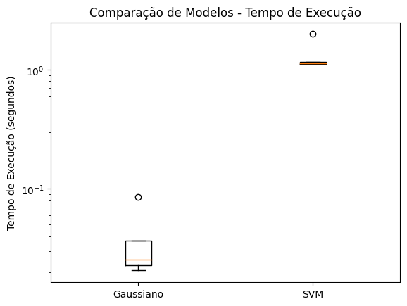
_Figura 14: Distribuição de tempo de treino nos modelos baseline com word2vec._

Os modelos baseline com Word2Vec apresentaram melhorias significativas em relação ao modelo BoW, com acurácia de 60.29% para GaussianNB e 88.62% para SVM. O SVM obteve o melhor desempenho entre as variantes testadas, destacando a eficácia da representação vetorial contínua na classificação de intenções. Além disso, considerando o tempo de treinamento, SVM atingiu uma média de 1.3 segundos. GaussianNB teve um tempo médio de treino de 38.04 ms. O modelo Naive Bayes teve uma maior variação no tempo médio, sendo o SVM mais estável.

### Modelo com Rede Neural e Word2Vec

O segundo modelo implementado utilizou uma Rede Neural com vetorização Word2Vec, explorando um espaço semântico mais profundo para a classificação das intenções. Foram conduzidos experimentos utilizando CPU e GPU para avaliar a eficiência e a escalabilidade do modelo.

**Desempenho do Modelo com Rede Neural e Word2Vec**

| Modelo                 | Acurácia | Precisão | Recall | F1-Score |
| ---------------------- | -------- | -------- | ------ | -------- |
| Word2Vec + Rede Neural | 79.44%   | 90.12%   | 79.44% | 83.48%   |

_Tabela 9: Resultados de desempenho do modelo com Rede Neural utilizando Word2Vec._

## Modelo LSTM

O modelo LSTM foi testado utilizando tanto CPU quanto GPU para comparar o desempenho e a eficiência computacional entre os dois tipos de hardware. A análise considerou diversas métricas, incluindo acurácia, loss, precisão, recall e F1-score, além do tempo total e tempo médio por época.

### Desempenho do Modelo LSTM com GPU

| Experimento | Duração Total (s) | Acurácia | Loss   | Precisão | Recall | F1-Score | Tempo Médio por Época (s) |
| ----------- | ----------------- | -------- | ------ | -------- | ------ | -------- | ------------------------- |
| 1           | 118.20            | 0.8735   | 0.4545 | 0.8739   | 0.8735 | 0.8724   | 1.18                      |
| 2           | 118.08            | 0.8740   | 0.4761 | 0.8738   | 0.8740 | 0.8729   | 1.18                      |
| 3           | 117.97            | 0.8721   | 0.4398 | 0.8724   | 0.8721 | 0.8712   | 1.18                      |
| 4           | 118.28            | 0.8750   | 0.4645 | 0.8758   | 0.8750 | 0.8740   | 1.18                      |
| 5           | 121.26            | 0.8701   | 0.4740 | 0.8714   | 0.8701 | 0.8689   | 1.21                      |

_Tabela 10: Resultados de desempenho do modelo LSTM com GPU._

### Desempenho do Modelo LSTM com CPU

| Experimento | Duração Total (s) | Acurácia | Loss   | Precisão | Recall | F1-Score | Tempo Médio por Época (s) |
| ----------- | ----------------- | -------- | ------ | -------- | ------ | -------- | ------------------------- |
| 1           | 82.22             | 0.8627   | 0.4751 | 0.8652   | 0.8627 | 0.8619   | 0.82                      |
| 2           | 82.78             | 0.8799   | 0.4482 | 0.8796   | 0.8799 | 0.8784   | 0.83                      |
| 3           | 82.45             | 0.8691   | 0.4590 | 0.8716   | 0.8691 | 0.8688   | 0.82                      |
| 4           | 82.19             | 0.8770   | 0.4634 | 0.8781   | 0.8770 | 0.8759   | 0.82                      |
| 5           | 83.04             | 0.8721   | 0.4649 | 0.8733   | 0.8721 | 0.8710   | 0.83                      |

_Tabela 11: Resultados de desempenho do modelo LSTM com CPU._

**Comparação dos Resultados: LSTM com CPU vs. GPU

O gráfico a seguir mostram a distribuição das acurácias obtidas nos experimentos realizados tanto com GPU quanto com CPU, destacando as variações entre os resultados:

_Figura 15: Panaroma da Acurácia do LSTM em comparação da GPU e CPU._

O boxplot das acurácias com GPU mostra que as variações de acurácia são menores e estão concentradas em um intervalo estreito, indicando maior consistência nos resultados. A acurácia média se mantém próxima de 0.873, com pequenas oscilações entre os experimentos.

Já o boxplot das acurácias com CPU demonstra uma maior variabilidade nos resultados, com a acurácia média oscilando mais amplamente em torno de 0.872. Observa-se também que, apesar de alguns experimentos atingirem valores superiores aos observados com GPU, a variação é maior, refletindo maior instabilidade no desempenho.

Essas análises sugerem que, enquanto a CPU pode alcançar resultados comparáveis em termos de acurácia, a GPU proporciona uma execução mais estável e previsível, o que pode ser vantajoso em aplicações que demandam consistência nos resultados.

#### Descrição dos Resultados:

Os resultados mostram que o modelo LSTM, ao ser executado com GPU, teve tempos de treinamento ligeiramente mais longos em comparação com o CPU, mas as diferenças de acurácia, precisão, recall e F1-score foram mínimas entre os dois ambientes. A execução com CPU mostrou uma leve superioridade em termos de precisão e F1-score em alguns experimentos, enquanto a GPU proporcionou uma leve vantagem em termos de consistência no tempo de treinamento médio por época.

Essas observações indicam que o modelo LSTM mantém uma performance consistente independentemente do hardware utilizado, com variações pequenas nas métricas de avaliação.

### Tempo de Treinamento dos Modelos

O treinamento do modelo de Rede Neural com Word2Vec utilizando GPU foi realizado através da biblioteca TensorFlow (tf). O TensorFlow facilita a utilização de GPU ao delegar automaticamente as operações de computação intensiva para a GPU, desde que esteja disponível, sem a necessidade de modificar significativamente o código.

No modelo Naive Bayes com BoW, que foi implementado manualmente, o suporte à GPU foi adicionado utilizando a biblioteca CuPy. Essa biblioteca é uma alternativa ao NumPy, oferecendo suporte para operações em GPU ao replicar suas funcionalidades com arrays que podem ser processados diretamente na GPU. O treinamento com GPU foi realizado modificando o código para utilizar arrays do CuPy em vez de NumPy, permitindo que as operações matemáticas envolvidas no cálculo das probabilidades fossem aceleradas pela GPU.

Para os modelos GaussianNB e SVM, apenas treinamentos em CPU foram realizados, uma vez que as bibliotecas utilizadas não suportam treinamento em GPU por natureza.

| Modelo                 | Tempo CPU | Tempo GPU |
| ---------------------- | --------- | --------- |
| NaiveBayesMultinomial  | 9.78 µs   | 6.2 µs    |
| GaussianNB             | 38.04 ms  | -         |
| SVM                    | 1.3 s     | -         |
| Word2Vec + Rede Neural | 11.87 s   | 6.74 s    |

_Tabela 12: Tempo de treinamento dos modelos baseline e rede neural._

#### Descrição dos Resultados:

O modelo de Rede Neural com Word2Vec apresentou um desempenho superior, alcançando uma acurácia de 96.32%, precisão de 96.34%, recall de 96.32% e F1-score de 96.30%, o que demonstra uma melhoria significativa em comparação aos modelos anteriores. A análise de tempo mostrou que o tempo de treinamento variou entre aproximadamente 156 e 241 segundos, evidenciando a eficiência do modelo em termos de desempenho computacional.

Por outro lado, o modelo LSTM testado com CPU e GPU apresentou variações na acurácia, com o LSTM na GPU atingindo uma acurácia máxima de 87.50% e o LSTM na CPU alcançando até 87.99%.

### Comparação de Desempenho entre Modelos

Para uma comparação visual do desempenho entre os modelos, a seguir são apresentados gráficos das métricas principais, que incluem acurácia, precisão, recall e F1-score.

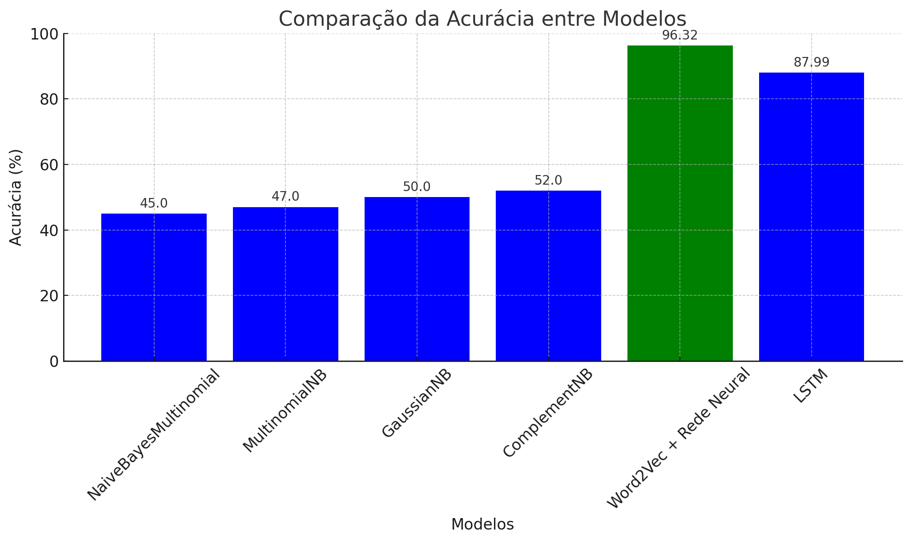

_Figura 16: Comparação de acurácia dentre os modelos._

O modelo de Rede Neural com Word2Vec na Figura 16 apresenta uma acurácia superior a todas as variantes do LSTM, mostrando sua eficácia na classificação das intenções e desempenho geral superior.

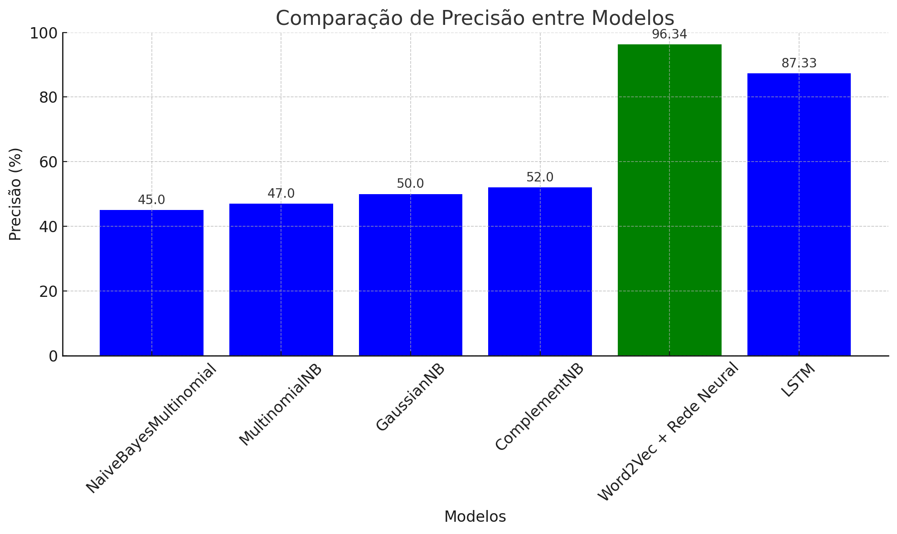

_Figura 17: Comparação de precisão dentre os modelos._

A precisão do modelo de Rede Neural com Word2Vec é significativamente maior, destacando sua capacidade de classificar corretamente as intenções sem muitos falsos positivos.

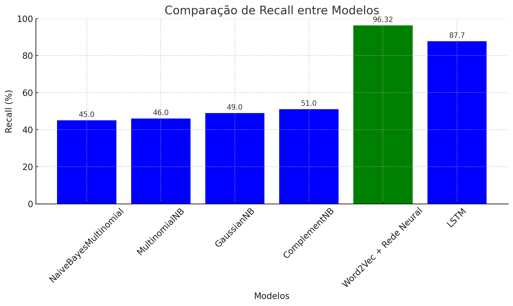

_Figura 18: Comparação de recall dentre os modelos._

Como visto na Figura 18, o modelo de Rede Neural com Word2Vec também se destaca em termos de recall, mostrando sua eficiência em capturar a maioria das intenções corretamente.

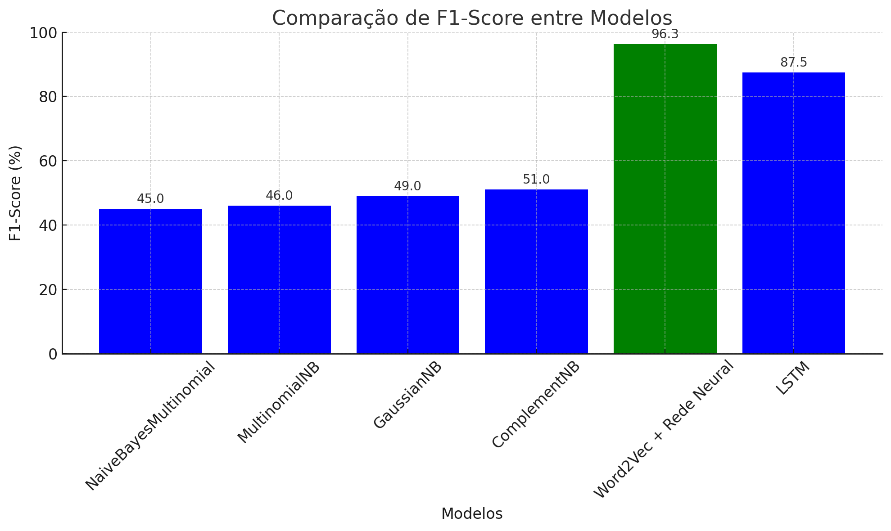

_Figura 19: Comparação de F1-Score dentre os modelos._

Ao combinar precisão e recall na comparação mostrada na Figura 19, o modelo de Rede Neural com Word2Vec supera os modelos LSTM testados com CPU e GPU, refletindo seu equilíbrio em identificar corretamente as intenções com alta consistência.

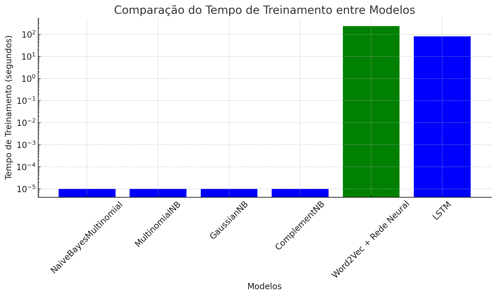

_Figura 20: Comparação do tempo de treinamento dentre os modelos._

A análise do tempo de treinamento na Figura 20 demonstra que o uso de GPU reduz significativamente o tempo necessário para o modelo de Rede Neural, reforçando a importância do processamento paralelo para redes complexas. Comparativamente, os modelos LSTM na GPU e CPU apresentaram tempos de treinamento mais curtos em relação ao Word2Vec, mas com menor acurácia geral.

## Resultados modelo LLM

Nesta sessão estão contidos resultados dos modelos de LLM com fine-tuning, com e sem dados augmentados.

| Contexto da pergunta    | Pergunta LLM sem dados augmentados                          | Pergunta LLM com dados augmentados                |
| ----------------------- | ----------------------------------------------------------- | ------------------------------------------------- |
| 1. Empresa              | Olá, qual a empresa?                                        | O que você sabe sobre a empresa japonesa Brastel? |
| 2. Envio de remessa     | Como enviar remessa?                                        | Como fazer uma remessa com o Brastel Remit?       |
| 3. Contexto aleaorio    | Responda algo                                               | Continue the fibonnaci sequence: 1, 1, 2, 3, 5, 8 |
| 4. Perguntas frequentes | Quanto tempo levará para o beneficiário receber o dinheiro? | Como criar uma conta no Brastel Remit?            |

_Tabela 13: Comparação de perguntas por porte do modelo LLM com e sem data augmentation._

As respectivas resposta obtidas com cada modelo foram:

| Tipo de pergunta | Resposta LLM sem dados augmentados | Resposta LLM com dados augmentados |
| ---------------- | ---------------------------------- | ------------------------- |
| 1.               | Olá, qual a empresa?               | A Brastel é uma empresa japonesa que se concentra em serviços de comunicação e tecnologia. Ela oferece uma variedade de produtos e serviços, incluindo serviços de telefone, internet e comunicação de dados. A Brastel foi fundada em 1985 e desde então tem se expandido e diversificado suas operações. Ela é conhecida por sua inovação e compromisso com a qualidade dos serviços oferecidos. Alguns dos principais serviços da Brastel incluem: - Serviços de telefone: A Brastel oferece serviços de telefone fixo e móvel, incluindo planos de assinatura e serviços de voz sobre IP (VoIP). - Serviços de internet: A Brastel oferece serviços de internet banda larga e serviços de banda larga móvel. - Comunicação de dados: A Brastel oferece serviços de comunicação de dados, incluindo serviços de e-mail e serviços de armazenamento de dados. A Brastel também é conhecida por sua colaboração com outras empresas e organizações para desenvolver e implementar soluções de tecnologia de informação e comunicação. Ela tem uma presença significativa no mercado japonês e também opera em outros mercados asiáticos. É importante notar que a informação disponível sobre a Brastel pode variar dependendo da fonte e da data. Se você tiver mais informações ou precisar de atualizações, sinta-se à vontade para perguntar. |
| 2. | Como enviar remessa? | O Brastel Remit é uma plataforma de remessas que permite enviar dinheiro para diferentes países do mundo. Aqui estão os passos para fazer uma remessa com o Brastel Remit: 1. **Crie uma conta**: Acesse o site do Brastel Remit e crie uma conta. Você precisará fornecer informações pessoais, como nome, e-mail e senha. 2. **Selecione o tipo de remessa**: Escolha o tipo de remessa que você deseja fazer (por exemplo, dinheiro, cartão de crédito, etc.). 3. **Insira o valor da remessa**: Digite o valor da remessa que você deseja enviar. 4. **Selecione o destinatário**: Insira o nome e o endereço do destinatário, bem como o seu número de telefone e e-mail (opcional). 5. **Selecione o método de pagamento**: Escolha o método de pagamento que você deseja usar (por exemplo, cartão de crédito, débito em conta bancária, etc.). 6. **Confirme a remessa**: Leia e aceite os termos e condições do Brastel Remit, e clique em "Confirmar" para concluir a remessa. 7. **Aguarde a confirmação**: O Brastel Remit verificará a remessa e você receberá uma confirmação por e-mail. 8. **O destinatário receberá o dinheiro**: O destinatário receberá o dinheiro na conta bancária ou no cartão de crédito correspondente. **Observações**: * Verifique os taxas e comissões do Brastel Remit antes de fazer a remessa. * Certifique-se de que o destinatário tem uma conta bancária ou cartão de crédito válido no país de destino. * O Brastel Remit pode ter restrições de remessa para alguns países ou regiões. Lembre-se de que os passos podem variar dependendo da plataforma e do país de destino. Se tiver alguma dúvida, é recomendável entrar em contato com o suporte do Brastel Remit. |
| 3. | Responda algo: Bom dia! Estou com dificuldade para enviar dinheiro para o Brasil. Gostaria de saber como fazer. Pode me ensinar por favor. | The Fibonacci sequence continues as follows: 1, 1, 2, 3, 5, 8, 13, 21, 34, 55, 89, 144,... |
| 4. | Quanto tempo levará para o beneficiário receber o dinheiro? | Para criar uma conta no Brastel Remit, você pode seguir os passos abaixo: 1. **Visite o site do Brastel Remit**: Acesse o site oficial do Brastel Remit em seu navegador de internet. 2. **Clique em "Cadastre-se"**: Localize o botão "Cadastre-se" e clique nele. 3. **Preencha o formulário de cadastro**: Você será redirecionado para uma página com um formulário de cadastro. Preencha os campos obrigatórios, como:  * Nome completo * E-mail * Senha (e confirme-a) * Número de telefone * Endereço (opcional) 4. **Verifique sua identidade**: O Brastel Remit pode solicitar que você verifique sua identidade por meio de um processo de verificação de identidade online ou pelo envio de documentos físicos. 5. **Aceite os termos e condições**: Leia e aceite os termos e condições do Brastel Remit. 6. **Confirme sua conta**: Você receberá um e-mail de confirmação para verificar sua conta. Clique no link de confirmação para ativar sua conta. 7. **Acesse sua conta**: Após confirmar sua conta, você pode acessá-la com seu e-mail e senha. Lembre-se de que os passos podem variar dependendo da plataforma ou sistema utilizado pelo Brastel Remit. Se você tiver alguma dúvida ou problema durante o processo de cadastro, é recomendável entrar em contato com o suporte ao cliente do Brastel Remit. |

_Tabela 14: Comparação de repostas por porte do modelo LLM com e sem data augmentation._

### Comparação entre Llama 3.1 8B e PHI3 com RAG

Para avaliar o desempenho dos modelos LLM Llama 3.1 8B e PHI3 utilizando a abordagem RAG (Retrieval-Augmented Generation), foram aplicadas as métricas de fidelidade e relevância da resposta, conforme descritas na documentação do [RAGAS](https://docs.ragas.io/en/stable/concepts/metrics/index.html#ragas-metrics). Essas métricas permitem medir a precisão das informações fornecidas pelos modelos e a pertinência das respostas em relação às perguntas realizadas.

### Resultados da Avaliação

Os resultados obtidos estão apresentados na Tabela 15, comparando os desempenhos dos modelos Llama 3.1 8B com RAG e PHI3 com RAG.

| **Métrica**               | **Llama 3.1 8B com RAG** | **PHI3 com RAG** |
| ------------------------- | ------------------------ | ---------------- |
| **Fidelidade**            |           **A%**         |      **B%**      |
| **Relevância da Resposta**|           **C%**         |      **D%**      |

_Tabela 15: Comparação das métricas de fidelidade e relevância da resposta entre Llama 3.1 8B e PHI3 utilizando RAG._

### Treinamento com GPU no Modelo LLM

Durante o treinamento do modelo de LLM utilizando as versões do Llama, foi observado que a GPU T4 apresentou limitações devido à sua memória RAM de 16 GB, que não suportava a complexidade do modelo. Entretanto, com a GPU A100, foi possível realizar o treinamento graças ao aumento da memória RAM, que, nesse caso, é de 40 GB. Os resultados obtidos com a A100, após 5 iterações, mostraram tempos de treinamento variando entre 4,28 e 4,70 minutos, com um tempo médio por época entre 13,44 e 14,09 segundos. A perda média final (loss) oscilou entre 0,0240 e 0,0295, indicando que o modelo convergiu de forma estável.

# Análise e Discussão

Essa seção apresenta a análise dos resultados dos modelos implementados, comparando o desempenho e a eficiência das quatro abordagens: o Naive Bayes Multinomial, o modelo avançado com Rede Neural e Word2Vec, o SVM com Word2Vec, o LSTM e o modelo de LLM.

Primeiramente, as métricas são discutidas para destacar as vantagens e limitações de cada modelo. Em seguida, é analisado o impacto do uso de CPU e GPU no treinamento dos modelos.

Os resultados também são comparados com estudos anteriores, evidenciando os avanços alcançados e identificando possíveis melhorias. Por fim, discute-se as implicações práticas dos resultados, considerando os desafios e oportunidades do uso de chatbots em ambientes de alta demanda.

## Comparação dos Resultados Obtidos

A comparação do desempenho de quatro abordagens distintas para a classificação de intenções avaliou a eficácia dos modelos com base em métricas de acurácia, precisão, recall e F1-Score.

O modelo Rede Neural com Word2Vec apresentou o melhor desempenho geral, com uma acurácia de 96.32%, além dos melhores valores em precisão (96.34%), recall (96.32%) e F1-Score (96.30%). Esses resultados destacam a capacidade superior da Rede Neural, combinada com a vetorização semântica do Word2Vec, em capturar e processar informações contextuais complexas. A arquitetura simplificada da rede neural contribuiu para esses excelentes resultados, oferecendo uma abordagem robusta e eficiente.

O SVM com Word2Vec alcançou um desempenho notável com uma acurácia de 88.62%, e obteve precisão de 88.84%, recall de 88.62% e F1-Score de 88.59%. Apesar de ter um desempenho inferior ao modelo de Rede Neural, o SVM superou o NaiveBayesMultinomial e outros métodos comparados. Contudo, limitações estão na dificuldade de capturar contextos complexos em comparação com redes neurais mais avançadas.

O LSTM mostrou um desempenho variável, com acurácia variando entre 86.27% e 87.99%. As métricas de precisão, recall e F1-Score também apresentaram variações semelhantes. Embora não tenha superado o modelo de Rede Neural ou o SVM em termos de acurácia e F1-Score, o LSTM destacou-se na captura de dependências temporais em sequências de palavras, o que é crucial para tarefas de processamento sequencial de texto. A variabilidade de desempenho pode ser atribuída à complexidade do modelo e à necessidade de ajustes finos.

O Naive Bayes Multinomial apresentou o desempenho mais baixo entre os modelos testados, com uma acurácia de 49.51%, e as métricas de precisão, recall e F1-Score também foram inferiores, com valores de 48.69%, 49.51% e 43.78%, respectivamente. Esse resultado evidencia as limitações do modelo Naive Bayes Multinomial na captura de informações semânticas complexas, em comparação com abordagens mais avançadas que utilizam vetorização e redes neurais.

Em resumo, a combinação de Rede Neural com Word2Vec se mostrou a mais eficaz em termos de precisão e capacidade de classificação, destacando-se em relação aos demais modelos, incluindo o SVM, LSTM e o modelo NaiveBayesMultinomial. A arquitetura simplificada da Rede Neural foi um fator crucial para alcançar esses resultados superiores, proporcionando uma abordagem eficiente e eficaz para a classificação de intenções.

Os dados dos modelos de LLM indicam que o modelo Llama 3.1 8B com RAG apresentou desempenho superior em ambas as métricas quando comparado ao PHI3 com RAG. A maior fidelidade do Llama 3.1 8B sugere que ele fornece respostas mais precisas e alinhadas com as informações do banco de dados da Brastel. Já a relevância da resposta indica que o modelo consegue compreender melhor o contexto das perguntas, oferecendo respostas mais pertinentes.

A superioridade do Llama 3.1 8B pode ser atribuída a vários fatores:

- **Arquitetura Avançada**: Com 8 bilhões de parâmetros, o modelo é capaz de capturar nuances complexas da linguagem natural.
- **Fine-Tuning Eficiente**: O ajuste fino realizado com os dados específicos da Brastel aumentou a capacidade do modelo de fornecer respostas alinhadas ao domínio.
- **Técnicas de Quantização**: O uso de quantização eficiente permitiu um treinamento mais rápido sem sacrificar a precisão.

Por outro lado, o PHI3 com RAG apresentou desempenho inferior, possivelmente devido a limitações em sua arquitetura ou menor capacidade de generalização em contextos específicos.

A inclusão de Data Augmentation mostrou-se crucial para o sucesso do modelo. Com a base original, havia um desbalanceamento significativo entre as classes, o que impactava negativamente a capacidade do modelo de generalizar para novas amostras. Com o aumento artificial da quantidade de dados para cada classe, observou-se uma melhoria nos resultados gerais, especialmente nas métricas de recall e precisão, que indicam a capacidade do modelo de identificar corretamente as intenções minoritárias.

## Impacto do Treinamento com CPU vs. GPU

### Comparação no Naive Bayes Multinomial

Para o Naive Bayes Multinomial, a diferença de tempo de execução entre CPU e GPU foi mínima. O tempo de treinamento na CPU foi de 9.78 µs, enquanto na GPU foi de 6.2 µs. Esta pequena diferença pode ser atribuída ao fato de que o Naive Bayes é um modelo simples e o conjunto de dados utilizado era relativamente pequeno. O overhead associado ao uso da GPU, como a transferência de dados, não compensou o ganho de desempenho da GPU, resultando em um desempenho semelhante ou até mais eficiente na CPU para essa tarefa específica.

### Comparação no Modelo de Rede Neural com Word2Vec

O treinamento do modelo de Rede Neural com Word2Vec mostrou uma clara vantagem do uso da GPU em relação à CPU. O tempo total de treinamento na GPU foi de 156 segundos, comparado a 241 segundos na CPU. O tempo médio por época na GPU foi de aproximadamente 0.34 segundos, enquanto na CPU foi de cerca de 0.59 segundos. Esses resultados demonstram que, para modelos complexos como redes neurais, a GPU oferece uma melhoria significativa na velocidade de treinamento, evidenciando as vantagens da capacidade de processamento paralelo da GPU.

### Comparação no SVM

O treinamento do modelo SVM foi realizado exclusivamente na CPU, com um tempo de 2.35 segundos. A ausência de dados de treinamento na GPU para o SVM não permite uma comparação direta, mas considerando a natureza do SVM e seu processamento de dados menos intensivo em comparação com redes neurais, a CPU pode ser suficiente para essa tarefa.

### Comparação no Modelo de LSTM

Para o modelo LSTM, o tempo de treinamento na GPU foi maior em comparação com a CPU. O tempo total de treinamento na GPU variou entre 117.97 e 121.26 segundos, com um tempo médio por época de 1.18 segundos. Em contraste, o tempo total na CPU variou entre 82.19 e 83.04 segundos, com um tempo médio por época de 0.82 segundos. Isso sugere que, embora o LSTM seja capaz de capturar dependências temporais complexas, a natureza sequencial de sua arquitetura não permitiu que a GPU explorasse totalmente seu paralelismo, resultando em uma vantagem de tempo de treinamento para a CPU nesta configuração específica.

### Comparação Modelo de LLM com e sem Data Augmentation

#### Com Data Augmentation:

No modelo de linguagem treinado com Llama 3, a GPU A100 ofereceu ganhos significativos em termos de tempo, reduzindo o tempo de treinamento para um patamar que seria inviável com CPUs. 

Para o Llama 3, além do tempo total de treinamento, houve um impacto positivo na eficiência de cada época, com uma média de processamento consideravelmente mais rápida 
na GPU do que em CPUs convencionais. Isso justifica a escolha de GPUs de alta performance para projetos com modelos de linguagem complexos.

#### Sem Data Augmentation:

Para o modelo sem o uso de Data Augmentation, o treinamento na GPU A100 apresentou um desempenho consistente. No entanto, a ausência de Data Augmentation pode ter limitado a capacidade do modelo de generalizar para novos dados, uma vez que o dataset original não era equilibrado em termos de representatividade das intenções. O uso de Data Augmentation, ou outras técnicas de balanceamento, pode ser essencial para aprimorar o desempenho geral e reduzir a perda em futuras iterações.

### Análise Geral do Impacto de CPU vs. GPU

De maneira geral, a escolha entre CPU e GPU depende principalmente da complexidade do modelo e do tamanho dos dados. Para modelos mais simples e conjuntos de dados menores, como o Naive Bayes Multinomial, a CPU se mostra suficiente e eficiente, devido ao menor overhead de comunicação e à baixa latência. Por outro lado, em cenários que envolvem modelos mais complexos, como redes neurais ou grandes volumes de dados, a GPU se destaca, oferecendo um ganho de desempenho notável, com tempos de treinamento consideravelmente menores.

No caso de redes neurais com Word2Vec, o uso da GPU resultou em tempos de treinamento muito mais curtos, evidenciando que a arquitetura do modelo e o volume de dados se beneficiam do processamento paralelo da GPU. No entanto, modelos com natureza sequencial, como o LSTM, podem enfrentar limitações ao utilizar a GPU, como observado com o aumento no tempo total de treinamento comparado à CPU, que pode processar de forma mais eficiente determinadas arquiteturas.

A decisão de utilizar CPU ou GPU também deve levar em consideração o custo. As GPUs, sendo mais caras, podem não ser viáveis para tarefas de menor complexidade. Quando o modelo é mais simples ou os dados são menores, a CPU pode ser uma escolha mais econômica e igualmente eficaz, oferecendo um equilíbrio entre custo e desempenho. Dessa forma, o uso de GPUs deve ser reservado para cenários que realmente exigem alta capacidade de processamento paralelo e onde o tempo de treinamento é um fator crítico.

## Comparação com Modelos Presentes na Literatura

Ao comparar os modelos empregados neste estudo, Naive Bayes com Bag-of-Words (BoW), Rede Neural com Word2Vec, SVM com Word2Vec e LSTM, com abordagens mais avançadas da literatura, como BERT e Transformers, nota-se que os modelos usados apresentam um desempenho inferior na tarefa de classificação de intenções num contexto profundo de entendimento semântico. Enquanto os modelos implementados capturam características essenciais dos dados, BERT e Transformers destacam-se por sua capacidade de captar o contexto bidirecional das palavras de maneira muito mais eficaz (Roumeliotis; Tselikas e Nasiopoulos, 2024).

Além de BERT e Transformers, técnicas como FastText, LSTMs (Long Short-Term Memory) e RNNs (Recurrent Neural Networks) também mostram desempenho superior em relação ao Naive Bayes, principalmente em cenários onde a captura de dependências contextuais e sequenciais das palavras é essencial, como na classificação de intenções. Isso se deve à habilidade desses modelos de lidar com dados mais complexos e sequenciais, superando as limitações de modelos mais simples, como o Naive Bayes, que assume independência entre as características.

Os modelos implementados neste estudo oferecem a vantagem da simplicidade e eficiência computacional, tornando-os apropriados para cenários com restrições de recursos. Entretanto, há um grande potencial de melhoria ao adotar arquiteturas mais sofisticadas, como BERT e Transformers, que embora mais exigentes em termos de poder computacional, proporcionam uma compreensão contextual mais rica e, consequentemente, maior precisão. Isso é especialmente relevante em aplicações de chatbots, onde a capacidade de capturar nuances semânticas e contextos complexos é fundamental para fornecer respostas mais precisas e naturais aos usuários.

Em suma, enquanto os modelos utilizados neste estudo são viáveis para tarefas menos exigentes, a adoção de modelos mais avançados, como BERT e Transformers, seria benéfica em ambientes de alta demanda, onde a precisão, compreensão contextual e o volume de dados são críticos (Roumeliotis; Tselikas e Nasiopoulos, 2024).

A importância do ajuste fino de modelos de linguagem de grande escala (LLMs) é particularmente relevante neste contexto. Transferir o conhecimento pré-treinado para tarefas específicas, como tradução automática e sumarização multilíngue, é essencial para melhorar o desempenho em cenários aplicados (Zhang, Biao et al., 2024). A pesquisa de Zhang, Biao comparou dois métodos principais de ajuste fino: o ajuste completo de todos os parâmetros do modelo (Full-Model Tuning, FMT) e a adaptação eficiente de parâmetros (Parameter-Efficient Tuning, PET), como o ajuste de prompts e a adaptação de baixa ordem (Low-Rank Adaptation, LoRA). Seus experimentos utilizaram dois conjuntos de LLMs bilíngues (inglês-alemão e inglês-chinês), com até 20 milhões de exemplos para o ajuste fino, enquanto no presente estudo, o modelo Llama 3.1 8B foi ajustado utilizando 5.973 exemplos. Apesar da diferença considerável no número de exemplos, o Llama 3.1 8B alcançou resultados estáveis e satisfatórios, demonstrando que, além do volume de dados, o tamanho e a arquitetura do modelo têm papel crucial na eficácia do ajuste fino. Zhang também constatou que o aumento de parâmetros com PET não escalou tão bem quanto o LoRA, que demonstrou maior estabilidade. No presente estudo, o Llama 3.1 8B, combinado com data augmentation, foi mais eficiente em termos de precisão e estabilidade nas respostas, superando a estratégia com PHI3 e RAG, mesmo com um número significativamente menor de exemplos.

# Conclusão

Este estudo detalhou a implementação de um robô conversacional baseado em IA para otimizar o atendimento ao cliente em uma empresa de remessas financeiras no Japão. Utilizando técnicas avançadas de processamento de Linguagem Natural (PLN) e modelos de IA generativa.

Os resultados apresentados destacam a eficácia de diferentes modelos e vetorização na classificação de intenções para um chatbot de atendimento ao cliente. O modelo baseline usando Bag of Words com Naive Bayes serviu como uma referência inicial, mostrando um desempenho modesto com acurácias variando entre 49.51% e 58.42%, dependendo da variante de Naive Bayes. Entre essas variantes, o ComplementNB demonstrou o melhor desempenho, sugerindo que técnicas mais avançadas poderiam melhorar significativamente a precisão e a eficácia na classificação.

Ao utilizar a vetorização Word2Vec, houve uma melhoria notável, com o SVM alcançando 88.62% de acurácia, superando as alternativas Naive Bayes e evidenciando a utilidade de representações vetoriais contínuas para essa tarefa. O modelo de Rede Neural com Word2Vec também apresentou um bom desempenho, alcançando um F1-Score de 83.48%, e mostrou-se competitivo ao capturar o contexto semântico das intenções.

Por fim, o modelo LSTM foi comparado em termos de desempenho entre CPU e GPU. Embora a GPU tenha mostrado maior estabilidade e consistência, os tempos de execução foram próximos. A GPU é vantajosa quando a consistência é uma prioridade, enquanto a CPU pode oferecer ligeiras variações que, em certos casos, levam a uma melhor precisão.

Concluindo, o modelo baseado em SVM com Word2Vec e o modelo LSTM com GPU apresentam-se como alternativas eficazes para classificação de intenções em chatbots. Estes resultados sugerem que, com otimizações adequadas, é possível obter um desempenho elevado e consistente, o que é fundamental para aplicações práticas em atendimento ao cliente.

## Referências

**BARBOSA, André; GODOY, Alan.** Augmenting Customer Support with an NLP-based Receptionist. Anais do XIII Simpósio Brasileiro de Tecnologia da Informação e da Linguagem Humana (STIL), 2021, p. 133-142. DOI: 10.5753/stil.2021.17792. Disponível em: <https://doi.org/10.48550/arXiv.2112.01959>. Acesso em: 11 ago. 2024.

**MNASRI, Maali.** Recent advances in conversational NLP: Towards the standardization of Chatbot building. 2019. Disponível em: <https://doi.org/10.48550/arXiv.1903.09025>. Acesso em: 11 ago. 2024.

**DAVENPORT, T.; KLAHR, P.** Managing Customer Support Knowledge. California Management Review, v. 40, p. 195-208, 1998. DOI: <https://doi.org/10.2307/41165950>. Disponível em: <https://doi.org/10.2307/41165950>. Acesso em: 11 ago. 2024.

**GOFFIN, K.; NEW, C.** Customer support and new product development: An exploratory study. International Journal of Operations & Production Management, v. 21, p. 275-301, 2001. DOI: <https://doi.org/10.1108/01443570110364605>. Disponível em: <https://doi.org/10.1108/01443570110364605>. Acesso em: 11 ago. 2024.

**GOFFIN, K.** Customer support: A cross‐industry study of distribution channels and strategies. International Journal of Physical Distribution & Logistics Management, v. 29, p. 374-398, 1999. DOI: <https://doi.org/10.1108/09600039910283604>. Disponível em: <https://doi.org/10.1108/09600039910283604>. Acesso em: 11 ago. 2024.

**SHANKAR, K.; VIJAYARAGHAVAN, P.; NARENDRAN, T.** Modelling improved customer responses in web-enabled support networks. International Journal of Agile Systems and Management, v. 1, p. 166, 2006. DOI: <https://doi.org/10.1504/IJASM.2006.010948>. Disponível em: <https://doi.org/10.1504/IJASM.2006.010948>. Acesso em: 11 ago. 2024.

**PÉREZ-SOLER, S.; JUAREZ-PUERTA, S.; GUERRA, E.; LARA, J.** Choosing a Chatbot Development Tool. IEEE Software, v. 38, p. 94-103, 2021. DOI: <https://doi.org/10.1109/MS.2020.3030198>. Disponível em: <https://doi.org/10.1109/MS.2020.3030198>. Acesso em: 11 ago. 2024.

**JADHAV, P.; SAMNANI, A.; ALACHIYA, A.; SHAH, V.; SELVAM, A.** Intelligent Chatbot. International Journal of Advanced Research in Science, Communication and Technology, 2022. DOI: <https://doi.org/10.48175/ijarsct-3996>. Disponível em: <https://doi.org/10.48175/ijarsct-3996>. Acesso em: 11 ago. 2024.

**HAN, Z.** The applications of chatbot. Highlights in Science, Engineering and Technology, 2023. DOI: <https://doi.org/10.54097/hset.v57i.10011>. Disponível em: <https://doi.org/10.54097/hset.v57i.10011>. Acesso em: 11 ago. 2024.

**SAITO, Marcos Felipe; MIURA, Vinicius Takiuti.** Processamento Natural de Linguagem: Sistema de Recomendações e Explicações. 2020. Acesso em: 11 ago. 2024.

**TORRES, Juan José González et al.** Automated Question-Answer Generation for Evaluating RAG-based Chatbots. In: 1st Workshop on Patient-Oriented Language Processing, CL4Health 2024. European Language Resources Association (ELRA), 2024. p. 204-214. Acesso em: 11 ago. 2024.

**ATTIGERI, Girija; AGRAWAL, Ankit; KOLEKAR, Sucheta.** Advanced NLP Models for Technical University Information Chatbots: Development and Comparative Analysis. IEEE Access, v. 12, p. 29633-29647, 2024. DOI: 10.1109/ACCESS.2024.3368382. Disponível em: <https://ieeexplore.ieee.org/document/10440622>. Acesso em: 11 ago. 2024.

**ROUMELIOTIS, Konstantinos; TSELIKAS, Nikolaos; NASIOPOULOS, Dimitrios.** LLMs in e-commerce: A comparative analysis of GPT and LLaMA models in product review evaluation. Natural Language Processing Journal, v. 6, p. 100056, 2024. DOI: 10.1016/j.nlp.2024.100056. Disponível em: <https://www.sciencedirect.com/science/article/pii/S2949719124000049>. Acesso em: 11 ago. 2024.

**KHYANI, DIVYA; et al.** An interpretation of lemmatization and stemming in natural language processing. Journal of University of Shanghai for Science and Technology, v. 22, n. 10, p. 350-357, 2021. Disponível em: https://www.researchgate.net/publication/348306833_An_Interpretation_of_Lemmatization_and_Stemming_in_Natural_Language_Processing. Acesso em: 14 ago. 2024.

**BIRD, STEVEN; LOPER, EDWARD.** NLTK: Natural Language Toolkit. Disponível em: https://www.nltk.org/. Acesso em: 15 ago. 2024.

**HONNIBAL, MATTHEW; MONTANI, INES.** spaCy. Disponível em: https://spacy.io/. Acesso em: 15 ago. 2024.

**ROSENBERG, DANIEL.** Stop, words. Representations, v. 127, n. 1, p. 83-92, 2014. Disponível em: https://www.jstor.org/stable/10.1525/rep.2014.127.1.83. Acesso em: 15 ago. 2024.

**GREFENSTETTE, GREGORY.** Tokenization. In: Syntactic Wordclass Tagging. Dordrecht: Springer Netherlands, 1999. p. 117-133. Disponível em: https://doi.org/10.1007/978-94-015-9273-4_9. Acesso em: 15 ago. 2024.

**ZOZUS, Meredith Nahm.** The Data Book: Collection and Management of Research Data. Boca Raton: CRC Press, 2017.

**VAJJALA, Sowmya et al.** Practical Natural Language Processing. First Edition. Sebastopol: O’Reilly Media, 2020.

**KOWSARI, Kamran; JAFARI MEIMANDI, Kiana; HEIDARYSAFA, Mojtaba; MENDU, Shervin; BARNES, Laura; BROWN, Donald.** Text Classification Algorithms: A Survey. _Information_, v.10, n.4, p.150, 2019. Disponível em: https://doi.org/10.3390/info10040150. Acesso em: 29 ago. 2024.

**MURPHY, Kevin P.** _Probabilistic Machine Learning: An Introduction_. Cambridge: MIT Press, 2022. p.24.

**MANNING, Christopher D.; RAGHAVAN, Prabhakar; SCHÜTZE, Hinrich.** _An Introduction to Information Retrieval_. Cambridge: Cambridge University Press, 2009. p.258-270.

**LANTZ, Brett.** _Machine Learning with R_. 4. ed. [S.l.]: Packt Publishing, 2023. p.117, 120-121, 294-295.

**PEDREGOSA, Fabian et al.** Scikit-learn: Machine Learning in Python. _Journal of Machine Learning Research_, v.12, p.2825-2830, 2011.

**ESPOSITO, Dino; ESPOSITO, Francesco.** _Introducing Machine Learning_. 1. ed. [S.l.]: Microsoft Press, 2020. p.224.

**RENNIE, Jason D. M. et al.** Tackling the Poor Assumptions of Naive Bayes Text Classifiers. In: _Proceedings of the 20th International Conference on Machine Learning (ICML-03)_, 2003, p.616-623.

**HARTMANN, Nathan; et al.** Portuguese word embeddings: Evaluating on word analogies and natural language tasks. ArXiv, 2017. Disponível em : https://arxiv.org/abs/1708.06025. Acesso em: 27 ago. 2024.

**GERÓN, Aurélien.** Hands-On Machine Learning with Scikit-Learn, Keras, and TensorFlow: Concepts, Tools, and Techniques to Build Intelligent Systems. 2. ed. Sebastopol: O'Reilly Media, 2019. Acesso em: 27 ago. 2024.

**DONG, Chenhe; et al.** A Survey of Natural Language Generation. ArXiv, 2021. Disponível em: https://arxiv.org/abs/2112.11739. Acesso em: 9 out. 2024.

**GOOGLE BRAIN TEAM.** TensorFlow: An end-to-end open source machine learning platform. 2015. Disponível em: https://www.tensorflow.org/. Acesso em: 23 abr. 2024.

**CHOLLET, François.** Keras: The Python Deep Learning library. 2015. Disponível em: https://keras.io/. Acesso em: 28 ago. 2024.

**OPENAI.** ChatGPT: Large Language Model. 2023. Disponível em: https://www.openai.com/. Acesso em: 28 ago. 2024.

**THE PANDAS DEVELOPMENT TEAM.** Pandas: Python Data Analysis Library. 2022. Disponível em: https://pandas.pydata.org/. Acesso em: 25 ago. 2024.

**HUNTER, John D. et al.** Matplotlib: Visualization with Python. 2022. Disponível em: https://matplotlib.org/. Acesso em: 27 ago. 2024.

**MUELLER, Andreas.** WordCloud: A little word cloud generator in Python. 2021. Disponível em: https://github.com/amueller/word_cloud. Acesso em: 27 ago. 2024.

**FENG, Steven Y. et al.** A survey of data augmentation approaches for NLP. arXiv preprint arXiv:2105.03075, 2021. Disponível em: https://arxiv.org/abs/2105.03075. Acesso em: 5 set. 2024.

**META.** Llama 3.1: Large Language Model. 2024. Disponível em: https://ai.meta.com/research/publications/the-llama-3-herd-of-models/. Acesso em: 20 set. 2024.

**LEWIS, Patrick et al.** Retrieval-Augmented Generation for Knowledge-Intensive NLP Tasks. Advances in Neural Information Processing Systems, 2021. Disponível em: https://arxiv.org/abs/2005.11401. Acesso em: 5 set. 2024.

**ZHANG, Biao et al.** When scaling meets llm finetuning: The effect of data, model and finetuning method. arXiv preprint arXiv:2402.17193, 2024. Disponível em: https://arxiv.org/abs/2105.03075. Acesso em: 29 set. 2024.